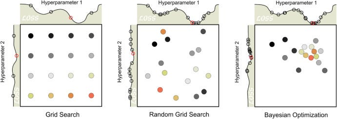
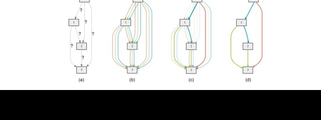
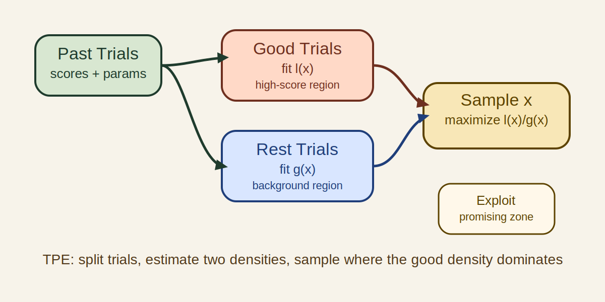
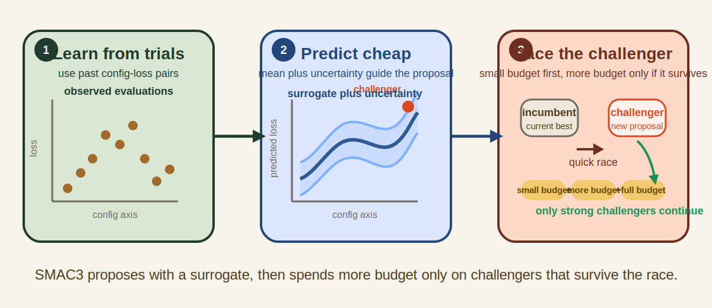
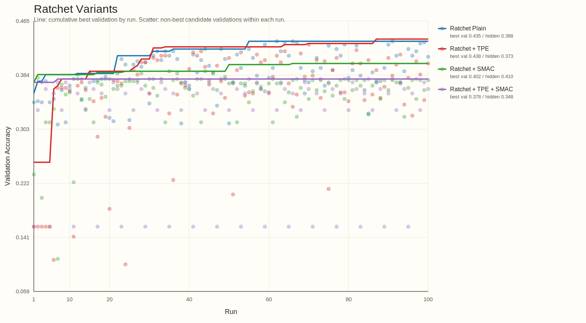
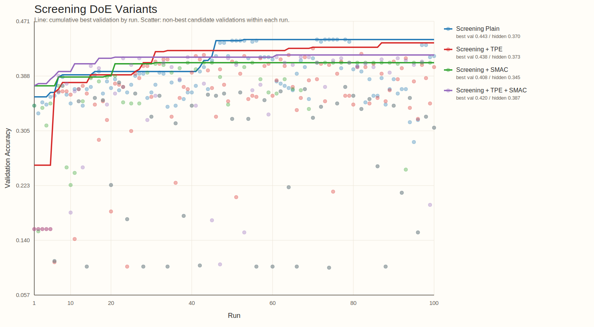
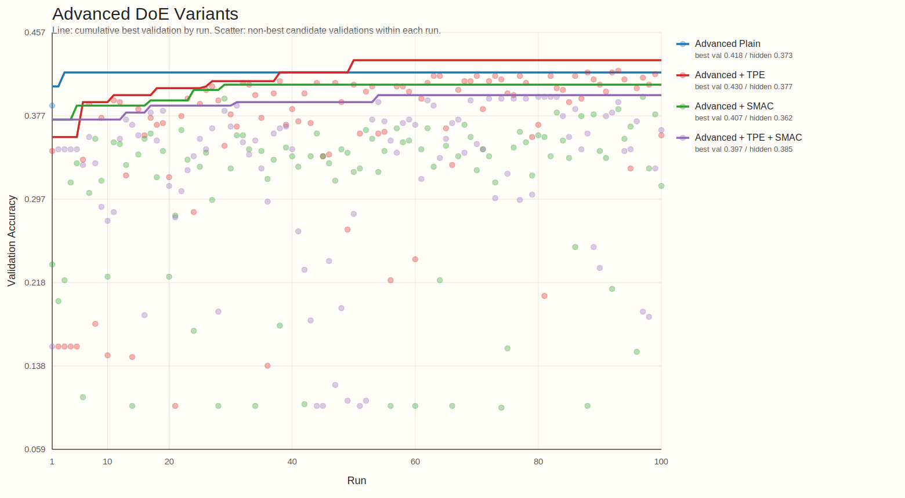
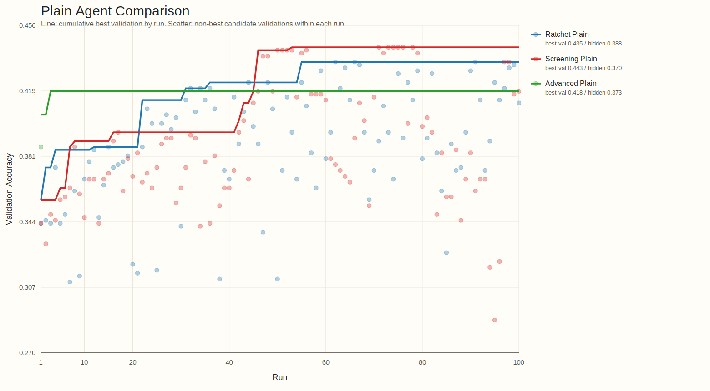
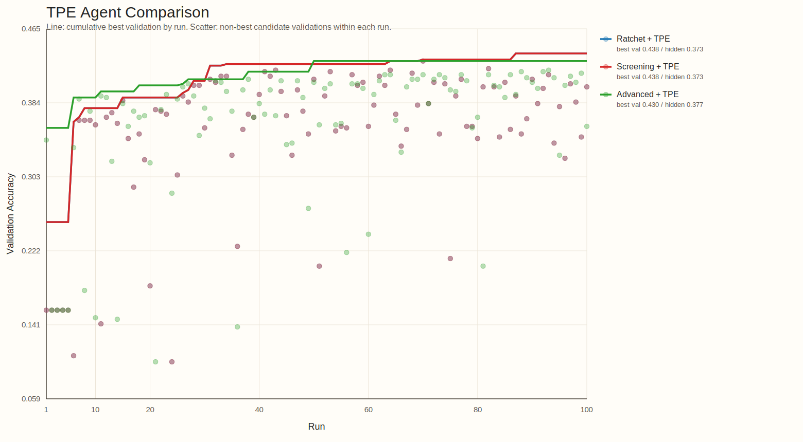
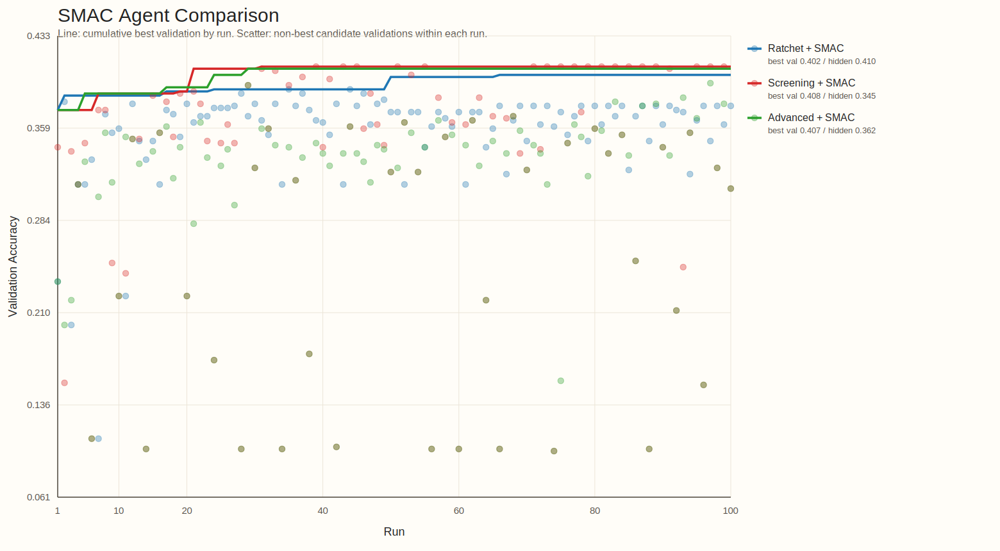

<!-- _class: title -->
<!-- footer: "" -->

# AutoML, Autoresearch, MLOps +@

26.4.8

서민교

---
<!-- footer: "AutoML 시작" -->

## 1. AutoML이란 무엇인가?

- 모델 개발 탐색 일부 자동화
- 대표 대상: `model selection`, `hyperparameter tuning`, `pipeline search`
- 핵심: 비교적 주어진 `search space` 안 최적 설정 탐색

---
<!-- footer: "NAS" -->

## 2. `Neural Architecture Search`는 AutoML의 확장이다

- parameter 대신 architecture 탐색
- AutoML의 `더 넓은 search space` 확장선
- 그래도 중심은 여전히 모델/파이프라인 후보 탐색

`hyperparameter search → pipeline search → architecture search`

---
<!-- footer: "Autoresearch의 등장" -->

## 3. `Autoresearch`는 어떻게 등장했고 무엇이 다른가?

- [karpathy/autoresearch](https://github.com/karpathy/autoresearch): 작은 training setup 위 `read → edit → run → keep-or-revert` loop 제시
- 연구 workflow 일부를 agent가 직접 수행하며, 설정 탐색을 넘어 `code`, `module`, `experiment` 자체 수정
- AutoML의 `fixed search space` 바깥으로 확장
- 이후 [RD-Agent](https://github.com/microsoft/RD-Agent), [AI-Scientist](https://github.com/SakanaAI/AI-Scientist), [GPT Researcher](https://github.com/assafelovic/gpt-researcher) 등으로 빠르게 확장

---
<!-- footer: "작업 흐름" -->

## 4. Agent 작업 흐름

- 코드 읽기, baseline 파악
- 작은 가설 하나 선택
- 학습 코드나 설정 수정
- 짧은 실험 실행, metric 확인
- 나쁘면 revert, 의미 있으면 keep
- 핵심: `edit 한 번`이 아니라 `짧은 실험 loop의 누적`

`Question → Read → Edit → Run → Analyze → Next experiment`

---
<!-- footer: "핵심 차이" -->

## 5. AutoML vs. Autoresearch

| 항목 | AutoML | Autoresearch |
| --- | --- | --- |
| 탐색 대상 | config, pipeline, architecture | hypothesis, code, module, experiment |
| 핵심 질문 | 어떤 설정이 가장 좋은가 | 다음에 어떤 실험을 해야 하는가 |
| edit 단위 | parameter / architecture | code / module / pipeline / experiment |
| 평가 방식 | objective 중심 | objective + reasoning + iteration |
| 위험 | 비효율적 탐색 | incoherent search, metric hacking |
| 필요한 인프라 | experiment infra | experiment + memory + harness |

---
<!-- footer: "사용례와 확장" -->

## 6. 사용례와 확장

사용례
- 문헌 조사 / deep research: [GPT Researcher](https://github.com/assafelovic/gpt-researcher)
- 코드 수정 + 실험 반복: [karpathy/autoresearch](https://github.com/karpathy/autoresearch), [RD-Agent](https://github.com/microsoft/RD-Agent)
- end-to-end 연구 자동화: [AI-Scientist](https://github.com/SakanaAI/AI-Scientist)

확장
- benchmark / evaluation: [MLE-bench](https://github.com/openai/mle-bench), [MLAgentBench](https://github.com/snap-stanford/MLAgentBench), [MLR-Bench](https://github.com/chchenhui/mlrbench)
- plugin / skill 생태계: [awesome-autoresearch](https://github.com/alvinreal/awesome-autoresearch), [Awesome Auto Research Tools](https://github.com/handsome-rich/Awesome-Auto-Research-Tools)
- memory, reusable modules, hardware fork

---
<!-- footer: "실험 관리 필요" -->

## 7. 체계적인 실험 관리의 필요

- 공통 문제: `많은 run` 비교와 누적
- 필수 요소: `tracking`, `lineage`, `orchestration`
- agent edit가 들어오면 `artifact`, `promotion`, `monitoring`, `cost control` 중요도 상승
- 결국 운영 문제

---
<!-- footer: "핵심 MLOps 요소" -->

## 8. AutoML과 Autoresearch가 공통으로 요구하는 MLOps 요소

| 요소 | AutoML에서의 역할 | Autoresearch에서의 역할 |
| --- | --- | --- |
| tracking | sweep 비교 | hypothesis / code edit history 비교 |
| orchestration | search job 실행 | agent + eval job 실행 |
| registry / lineage | best model 승격 | experiment / prompt / code provenance 보존 |
| monitoring / cost | retrain trigger, SLO | budget, drift, unsafe promotion guardrail |

---
<!-- footer: "Kubeflow lifecycle" -->

## 9. MLOps는 모델 개발, 관리, 배포 파이프라인을 유지 관리하는 작업이다

- Autoresearch loop는 이 큰 ML lifecycle 안의 일부
- 실제 시스템: `data`, `experiment`, `model registry`, `deployment`, `monitoring`
- 핵심 역할: `지속 운영`, `추적`, `승격`, `유지관리`

---
<!-- footer: "두 질문" -->

## 10. 두 질문

- 성능: `(AutoML의 도메인에서)` `Autoresearch`는 baseline보다 낫나
- 운영: `Autoresearch`에 어떤 harness가 있으면 좋을까

---
<!-- footer: "질문 1 셋업" -->

## 11. 질문 1 셋업

| Arm | 의미 |
| --- | --- |
| baseline only | `Optuna TPE`, `SMAC3` |
| agent only | plain `Autoresearch` |
| hybrid | `agent + TPE`, `agent + SMAC3`, `agent + TPE+SMAC` |
| direct | `TPE direct`, `SMAC direct` |

---
<!-- _class: tinytext -->
<!-- footer: "관련 문헌" -->

## 12. 관련 문헌

- [Using Large Language Models for Hyperparameter Optimization](https://arxiv.org/abs/2312.04528)
  - 실험 이력 기반 순차 튜닝은 가능하지만, 장기적으로 BO 우위는 불명확하다.
- [LLAMBO: Large Language Models to Enhance Bayesian Optimization](https://arxiv.org/abs/2402.03921)
  - LLM은 BO를 대체하기보다 초기 탐색을 강화하는 보조 수단에 가깝다.
- [AgentHPO: Large Language Model Agent for Hyper-Parameter Optimization](https://arxiv.org/abs/2402.01881)
  - Agent형 LLM HPO는 가능성을 보였지만, BO 대비 성능 우위 근거는 약하다.
- [SLLMBO: Sequential Large Language Model-Based Hyper-parameter Optimization](https://arxiv.org/abs/2410.20302)
  - Hybrid LLM-BO 방식은 일부 태스크에서 classical BO보다 강하다.

---
<!-- footer: "Optuna TPE" -->

## 13. Optuna TPE

- `Run History`: observed trial을 `good set`과 `rest`로 나눈다
- `Search Model`: `l(x)`는 good set, `g(x)`는 rest의 density를 근사한다
- `Selection Rule`: `l(x) / g(x)`가 큰 후보를 다음 trial로 고른다
- 함의: bounded space에서 빠르게 수렴하는 `exploit-heavy` baseline이다

<small>source: [Optuna TPESampler docs](https://optuna.readthedocs.io/en/v4.4.0/reference/samplers/generated/optuna.samplers.TPESampler.html)</small>

---
<!-- footer: "SMAC3" -->

## 14. SMAC3

- `Run History`: observed config-loss pair로 surrogate를 학습한다
- `Search Model`: surrogate는 mean과 uncertainty로 promising region을 예측한다
- `Selection Rule`: acquisition이 challenger를 고르고, intensifier가 incumbent와 붙인다
- 함의: mixed, categorical, conditional space에서 강한 `model-based` baseline이다

<small>source: [SMAC3 docs](https://automl.github.io/SMAC3/main/), [Components](https://automl.github.io/SMAC3/v2.0.2/advanced_usage/1_components.html), [Intensifier](https://automl.github.io/SMAC3/v2.2.0/api/smac.intensifier.intensifier.html)</small>

---
<!-- footer: "결과 TBD" -->

## 15. 결과 TBD

**TBD**

- 실험 진행 중
- 동일 조건 결과 표 추가 예정
- `best val`, `best hidden`, search trace를 함께 정리할 예정
- 질문 1의 결론은 여기서 닫힌다

---
<!-- footer: "질문 2 셋업" -->

## 16. 질문 2 셋업

| Agent | 운영 방식 | 질문 |
| --- | --- | --- |
| `Ratchet` | incumbent 근처 exploit | 얼마나 빨리 올리나 |
| `Screening` | main effect 분리 | 무엇이 먹히나 |
| `Advanced` | staged DOE | 어떻게 다음 round를 설계하나 |

---
<!-- footer: "실험 설정" -->

## 17. 실험 설정

| 항목 | 설정 |
| --- | --- |
| benchmark | `cifar10_real` |
| model | `mlp` |
| conditions | `14` |
| budget | condition당 `100 + finalize 1` |

- 비교 대상: `plain`, `TPE`, `SMAC`, `TPE+SMAC`, direct
- 목표: code edit가 아니라 bounded `AutoML + harness` 비교

---
<!-- footer: "탐색 축" -->

## 18. 탐색 축

| 그룹 | 변수 |
| --- | --- |
| preprocessing | `normalization`, `projection`, `resampling` |
| architecture | `hidden_dims`, `activation`, `norm layer` |
| optimization | `solver`, `lr`, `batch` |
| regularization | `wd`, `dropout`, `noise` |

- 한 축만 바꾸는 round와 여러 축을 묶는 round를 구분해서 본다

---
<!-- footer: "결과 요약" -->

## 19. 결과 요약

| 관점 | 조건 | 점수 |
| --- | --- | --- |
| best val | `screening_plain` | `0.4433` |
| best hidden | `ratchet_smac` | `0.4100` |
| best direct hidden | `tpe_direct` | `0.3733` |

- 핵심: validation winner와 finalize winner가 다르다.
- 함의: harness가 peak와 generalization을 다르게 만든다.
- 따라서 mid-run 최고점만으로 harness를 평가하면 오판한다.

---
<!-- footer: "Ratchet" -->

## 20. Ratchet

- 관찰: `TPE`가 validation ceiling을 가장 높게 만든다.
- 관찰: hidden winner는 `SMAC` 쪽에서 나온다.
- 해석: ratchet은 exploit엔 강하지만 finalize 성능은 advisor choice에 민감하다.

---
<!-- footer: "Screening" -->

## 21. Screening

- 관찰: `plain`이 전체 best val을 만든다.
- 관찰: hidden에선 `TPE+SMAC`이 family 최고다.
- 해석: screening policy 자체가 강하고, dual advisor 이득은 late-stage에서만 제한적으로 보인다.

---
<!-- footer: "Advanced" -->

## 22. Advanced

- 관찰: plain 조건은 ceiling이 낮다.
- 관찰: advisor가 붙을 때만 상위권에 오른다.
- 해석: 복잡한 sequential design은 짧은 budget에서 proposal quality 의존성이 크다.

---
<!-- footer: "Plain" -->

## 23. Plain

- 관찰: advisor 없이도 profile 간 차이가 크게 난다.
- 관찰: `screening_plain`은 val 1등, `ratchet_plain`은 hidden family 1등이다.
- 해석: baseline behavior는 advisor보다 harness가 먼저 규정한다.

---
<!-- footer: "TPE" -->

## 24. TPE

- 관찰: `ratchet`과 `screening`이 같은 ceiling에 도달한다.
- 관찰: `advanced`도 좋아지지만 상위 둘을 넘지는 못한다.
- 해석: `TPE`는 profile 차이를 줄이고 incumbent 근처 수렴을 강화한다.

---
<!-- footer: "SMAC" -->

## 25. SMAC

- 관찰: best val은 `screening_smac`에서 나온다.
- 관찰: best hidden은 `ratchet_smac`에서 나온다.
- 해석: 같은 advisor라도 harness가 selection pressure와 finalize generalization을 바꾼다.

---
<!-- footer: "핵심 함의" -->

## 26. 핵심 함의

- harness effect는 advisor effect만큼 크다.
- validation 최적화와 finalize 최적화는 다른 문제다.
- dual advisor는 항상 단일 advisor를 이기지 않는다.
- 따라서 harness 평가는 `누가 더 똑똑한가`보다 `무엇을 어떻게 보게 만드는가`를 봐야 한다.

---
<!-- footer: "운영 교훈" -->

## 27. 운영 교훈

- 지표: `best val`만 보지 말고 `finalize`, `artifact completeness`를 같이 봐야 한다.
- 설계: `isolate / history / finalize` 분리가 있어야 중간 최고와 최종 승자를 함께 읽는다.
- 로그: advisor trace에는 invalid proposal이 섞일 수 있어 guard가 필요하다.
- 판정: run 수와 history row 수를 혼동하면 early finalize가 생긴다.

---
<!-- footer: "한계" -->

## 28. 한계

- 단일 benchmark, single split
- budget `100`, top-k reseeding 없음
- code-edit autoresearch는 아직 제외
- 따라서 이번 결론은 `bounded AutoML harness` 범위에 한정된다

---
<!-- _class: tinytext -->
<!-- footer: "출처" -->

## 29. References

| 구분 | 예시 |
| --- | --- |
| curated landscape | [awesome-autoresearch](https://github.com/alvinreal/awesome-autoresearch), [Awesome Auto Research Tools](https://github.com/handsome-rich/Awesome-Auto-Research-Tools) |
| end-to-end systems | [karpathy/autoresearch](https://github.com/karpathy/autoresearch), [RD-Agent](https://github.com/microsoft/RD-Agent), [AI-Scientist](https://github.com/SakanaAI/AI-Scientist) |
| deep research | [GPT Researcher](https://github.com/assafelovic/gpt-researcher) |
| evaluation | [MLE-bench](https://github.com/openai/mle-bench), [MLAgentBench](https://github.com/snap-stanford/MLAgentBench), [MLR-Bench](https://github.com/chchenhui/mlrbench) |
| optimization baselines | [Optuna docs](https://optuna.readthedocs.io/en/stable/reference/samplers/index.html), [SMAC3 docs](https://automl.github.io/SMAC3/main/) |
| visuals | [AutoML image](https://miro.medium.com/v2/resize:fit:1382/1*ip8VpZ4_KJP8R5EwJ3zRgw.jpeg), [NAS image](https://i.ytimg.com/vi/_dR8a5ZcBgM/sddefault.jpg), [Kubeflow model registry lifecycle image](https://www.kubeflow.org/docs/components/model-registry/images/ml-lifecycle-kubeflow-modelregistry.drawio.svg) |
