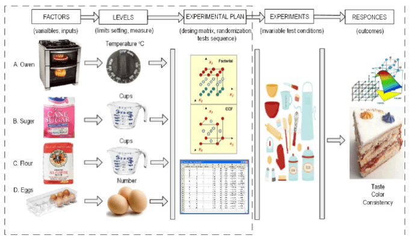
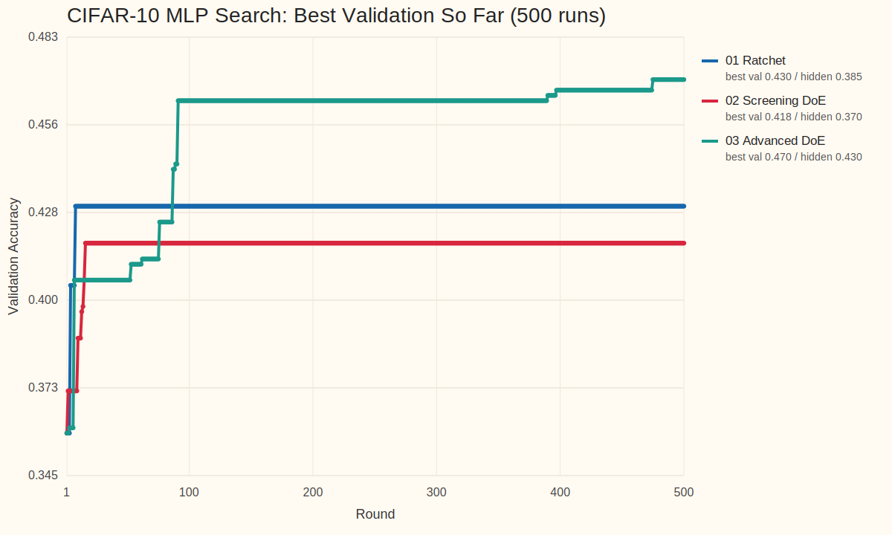
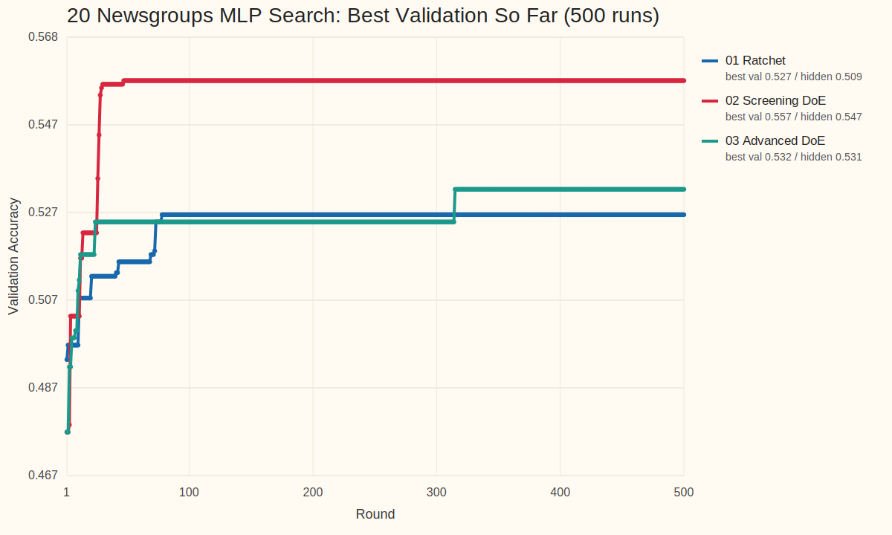

<!-- _class: title -->
<!-- footer: "" -->

# AutoML, Autoresearch, MLOps +@

26.4.7

서민교

---
<!-- footer: "AutoML 시작" -->

## 1. AutoML이란 무엇인가?

- 모델 개발 탐색 일부 자동화
- 대표 대상: `model selection`, `hyperparameter tuning`, `pipeline search`
- 핵심: 비교적 주어진 `search space` 안 최적 설정 탐색

---
<!-- footer: "NAS" -->

## 2. `Neural Architecture Search`는 AutoML의 확장이다

- parameter 대신 architecture 탐색
- AutoML의 `더 넓은 search space` 확장선
- 그래도 중심은 여전히 모델/파이프라인 후보 탐색

`hyperparameter search → pipeline search → architecture search`

---
<!-- footer: "Autoresearch의 등장" -->

## 3. `Autoresearch`는 어떻게 등장했고 무엇이 다른가?

- [karpathy/autoresearch](https://github.com/karpathy/autoresearch): 작은 training setup 위 `read → edit → run → keep-or-revert` loop 제시
- 연구 workflow 일부를 agent가 직접 수행하며, 설정 탐색을 넘어 `code`, `module`, `experiment` 자체 수정
- AutoML의 `fixed search space` 바깥으로 확장
- 이후 [RD-Agent](https://github.com/microsoft/RD-Agent), [AI-Scientist](https://github.com/SakanaAI/AI-Scientist), [GPT Researcher](https://github.com/assafelovic/gpt-researcher) 등으로 빠르게 확장

---
<!-- footer: "작업 흐름" -->

## 4. Agent 작업 흐름

- 코드 읽기, baseline 파악
- 작은 가설 하나 선택
- 학습 코드나 설정 수정
- 짧은 실험 실행, metric 확인
- 나쁘면 revert, 의미 있으면 keep
- 핵심: `edit 한 번`이 아니라 `짧은 실험 loop의 누적`

`Question → Read → Edit → Run → Analyze → Next experiment`

---
<!-- footer: "핵심 차이" -->

## 5. AutoML vs. Autoresearch

| 항목 | AutoML | Autoresearch |
| --- | --- | --- |
| 탐색 대상 | config, pipeline, architecture | hypothesis, code, module, experiment |
| 핵심 질문 | 어떤 설정이 가장 좋은가 | 다음에 어떤 실험을 해야 하는가 |
| edit 단위 | parameter / architecture | code / module / pipeline / experiment |
| 평가 방식 | objective 중심 | objective + reasoning + iteration |
| 위험 | 비효율적 탐색 | incoherent search, metric hacking |
| 필요한 인프라 | experiment infra | experiment + memory + harness |

---
<!-- footer: "사용례와 확장" -->

## 6. 사용례와 확장

사용례
- 문헌 조사 / deep research: [GPT Researcher](https://github.com/assafelovic/gpt-researcher)
- 코드 수정 + 실험 반복: [karpathy/autoresearch](https://github.com/karpathy/autoresearch), [RD-Agent](https://github.com/microsoft/RD-Agent)
- end-to-end 연구 자동화: [AI-Scientist](https://github.com/SakanaAI/AI-Scientist)

확장
- benchmark / evaluation: [MLE-bench](https://github.com/openai/mle-bench), [MLAgentBench](https://github.com/snap-stanford/MLAgentBench), [MLR-Bench](https://github.com/chchenhui/mlrbench)
- plugin / skill 생태계: [awesome-autoresearch](https://github.com/alvinreal/awesome-autoresearch), [Awesome Auto Research Tools](https://github.com/handsome-rich/Awesome-Auto-Research-Tools)
- memory, reusable modules, hardware fork

---
<!-- footer: "실험 관리 필요" -->

## 7. 체계적인 실험 관리의 필요

- 공통 문제: `많은 run` 비교와 누적
- 필수 요소: `tracking`, `lineage`, `orchestration`
- agent edit가 들어오면 `artifact`, `promotion`, `monitoring`, `cost control` 중요도 상승
- 결국 운영 문제

---
<!-- footer: "핵심 MLOps 요소" -->

## 8. AutoML과 Autoresearch가 공통으로 요구하는 MLOps 요소

| 요소 | AutoML에서의 역할 | Autoresearch에서의 역할 |
| --- | --- | --- |
| tracking | sweep 비교 | hypothesis / code edit history 비교 |
| orchestration | search job 실행 | agent + eval job 실행 |
| registry / lineage | best model 승격 | experiment / prompt / code provenance 보존 |
| monitoring / cost | retrain trigger, SLO | budget, drift, unsafe promotion guardrail |

---
<!-- footer: "Kubeflow lifecycle" -->

## 9. MLOps는 모델 개발, 관리, 배포 파이프라인을 유지 관리하는 작업이다

- Autoresearch loop는 이 큰 ML lifecycle 안의 일부
- 실제 시스템: `data`, `experiment`, `model registry`, `deployment`, `monitoring`
- 핵심 역할: `지속 운영`, `추적`, `승격`, `유지관리`

---
<!-- footer: "부족한 점" -->

## 10. Autoresearch의 단점

- 실험이 즉흥적으로 이어지기 쉬움
- 왜 이 실험을 했는지 attribution이 약함
- 큰 수정, 작은 튜닝, 검증 실험이 섞이기 쉬움
- robustness, replication, interaction 확인이 뒤로 밀림
- 잘 정리된 random search로 퇴화할 위험

---
<!-- footer: "필요한 harness" -->

## 11. 어떤 Harness가 필요한가

- 무엇을 먼저 볼지 정하는 우선순위
- 어떤 조합을 함께 볼지 정하는 규율
- 탐색 단계와 검증 단계 분리
- 작은 수정과 큰 수정을 다르게 다루는 운영 규칙
- 실패도 정보로 남기는 구조
- 다음 라운드를 설계하는 순차 실험 체계

---
<!-- footer: "DoE 개념" -->

## 12. Design of Experiments(DoE)란 무엇인가

- 여러 요인을 한 번에 바꿔 보며 effect를 읽는 실험 설계
- 한 번의 최고점보다 `요인`, `상호작용`, `안정성` 파악에 강점
- 핵심 질문: 무엇을 바꿨고, 무엇이 실제로 영향을 줬는가

---
<!-- footer: "빌려오는 DoE 개념" -->

## 13. DoE에서 빌려오는 개념

- `screening`: 중요한 요인부터 좁히기
- `factorial thinking`: interaction 보기
- `sequential design`: 라운드별 정교화
- `robust design`: 평균이 아니라 안정성까지 확인
- `mixture / allocation`: 예산과 비율 배분

---
<!-- footer: "비교 agents" -->

## 14. DoE-guided 운영과 비교한 Agents

| Agent | 운영 방식 | 특징 |
| --- | --- | --- |
| `01 Ratchet` | local ratchet loop | incumbent를 branch head로 두고 좁게 mutation |
| `02 Screening DoE` | simple screening | round마다 한 design question만 분리해 main effect를 읽음 |
| `03 Advanced DoE` | staged DoE program | screening → interaction check → local refinement |

---
<!-- footer: "실험 설정" -->

## 15. 실험 설정

| 항목 | 설정 |
| --- | --- |
| benchmarks | `cifar10_real`, `twenty_newsgroups_real` |
| data budget | CIFAR-10 `max_samples=4000`, 20 Newsgroups `max_samples=8000` |
| model | `mlp` |
| agents | `01 Ratchet`, `02 Screening DoE`, `03 Advanced DoE` |
| execution | dataset × agent별 isolated root `6`개에서 validation `500` runs 후 hidden finalize |

실행 조건
- agent별 isolated root를 따로 만들어 context leakage 없이 독립 실행
- validation-only `500` runs를 먼저 누적하고 hidden test는 마지막 `finalize-agent`에서만 공개
- 이번 batch는 이전 curated `8` knobs가 아니라 넓어진 MLP search surface를 사용

열려 있는 주요 축
- preprocessing: `normalization`, `outlier`, `projection`, `resampling`
- architecture: `hidden_dims`, `activation`, `normalization_layer`
- optimization: `solver`, `learning_rate`, `batch_size`, `max_iter`
- regularization / stability: `weight_decay`, `dropout`, `noise`, `label_smoothing`, `residual_connections`

---
<!-- footer: "결과 테이블" -->

## 16. CIFAR-10 결과: validation 탐색과 hidden test

조건: `cifar10_real` / `mlp` / broad search surface / validation `500` runs + hidden finalize

| Agent | Best Val | Hidden Test | Gap | Run of Best | Incumbent Updates |
| --- | --- | --- | --- | --- | --- |
| `01 Ratchet` | `0.4300` | `0.3850` | `0.0450` | `8` | `3` |
| `02 Screening DoE` | `0.4183` | `0.3700` | `0.0483` | `16` | `7` |
| `03 Advanced DoE` | `0.4700` | `0.4300` | `0.0400` | `475` | `12` |

대표 config
- `01 Ratchet`: `standard + [128,128] + relu + adam + batchnorm + wd=1e-5 + lr=0.002 + bs=64`
- `02 Screening DoE`: `standard + clip_percentile + [128,64] + relu + adamw + batchnorm + cosine + residual`
- `03 Advanced DoE`: `maxabs + pca32 + [128,64] + leaky_relu + adamw + batchnorm + dropout`

---
<!-- footer: "탐색 궤적" -->

## 17. CIFAR-10 결과: 탐색 궤적

- `Ratchet`은 `run 8`에 좋은 basin을 찾았지만 그 뒤 장기 개선은 거의 없었다.
- `Screening DoE`는 `run 16`까지 빠르게 올라갔지만 ceiling이 낮았다.
- `Advanced DoE`는 `run 475`까지 improvement를 이어가며 가장 높은 validation과 hidden을 모두 만들었다.

---
<!-- footer: "CIFAR 해석" -->

## 18. CIFAR-10 해석

- 넓어진 search space에서는 late-stage staged DoE payoff가 확실했다.
- image 쪽에서는 projection, AdamW, dropout, batchnorm 조합이 실제로 도움이 됐다.
- `Ratchet`은 빠른 basin discovery에는 강했지만 interaction-heavy region으로는 잘 못 넘어갔다.
- `Screening DoE`는 main effect 파악은 빨랐지만, 후반 refinement depth는 `Advanced DoE`보다 약했다.

---
<!-- footer: "Text 결과" -->

## 19. 20 Newsgroups 결과: validation 탐색과 hidden test

조건: `twenty_newsgroups_real` / `mlp` / broad search surface / validation `500` runs + hidden finalize

| Agent | Best Val | Hidden Test | Gap | Run of Best | Incumbent Updates |
| --- | --- | --- | --- | --- | --- |
| `01 Ratchet` | `0.5267` | `0.5092` | `0.0175` | `78` | `10` |
| `02 Screening DoE` | `0.5575` | `0.5475` | `0.0100` | `47` | `11` |
| `03 Advanced DoE` | `0.5325` | `0.5308` | `0.0017` | `315` | `9` |

대표 config
- `01 Ratchet`: `signed_log1p + svd256 + [64,32] + gelu + adam + input_noise`
- `02 Screening DoE`: `robust + no projection + [64,64] + relu + adam + linear_decay + dropout`
- `03 Advanced DoE`: `standard + no projection + [128,128] + tanh + adam + wd=1e-4`

---
<!-- footer: "Text 궤적" -->

## 20. 20 Newsgroups 결과: 탐색 궤적

- `Screening DoE`는 `run 47`에 winner를 찾고 끝까지 유지했다.
- `Advanced DoE`는 `run 315`까지 늦게 개선했지만 text에서는 screening을 넘지 못했다.
- `Ratchet`도 개선은 했지만, 500-run budget을 모두 가치 있게 쓰지는 못했다.

---
<!-- footer: "Text 해석" -->

## 21. 20 Newsgroups 해석

- sparse TF-IDF text 공간에서는 first-order screening payoff가 interaction 탐색보다 컸다.
- best text config는 projection 없이도 충분히 강했고, robust scaling과 중간 폭 MLP가 안정적이었다.
- `Advanced DoE`는 late improvement는 있었지만, 그 budget이 screening의 early win을 뒤집지는 못했다.
- `Ratchet`은 좋은 region은 찾았지만 후반 loop discipline이 약했다.

---
<!-- footer: "지식 추출" -->

## 22. 히스토리에서 남는 지식

`01 Ratchet`
- 빠른 basin discovery에는 여전히 유용하다.
- CIFAR에선 early width/normalization search, text에선 noise/SVD 조합을 빨리 찾았다.
- 대신 plateau 뒤 reset discipline이 약하면 긴 예산을 낭비하기 쉽다.

`02 Screening DoE`
- text prior: `robust/no projection/relu/adam` 계열이 강하다.
- CIFAR에서는 early screens로 상위 basin은 찾지만, late interaction payoff는 제한적이다.
- 두 dataset 모두 best를 비교적 이른 round에 찾는 경향이 강했다.

`03 Advanced DoE`
- CIFAR prior: `projection + AdamW + stronger regularization` 조합이 late-stage에서 실제 payoff를 냈다.
- text에서는 late staged refinement가 improvement는 만들었지만 winner를 바꾸지는 못했다.
- 넓은 search space일수록 staged DoE 가치가 커지고, 단순한 space일수록 screening이 더 싸고 강하다.

---
<!-- footer: "히스토리 진단" -->

## 23. 히스토리 진단

| Agent | CIFAR trace | Text trace | 읽을 점 |
| --- | --- | --- | --- |
| `Ratchet` | best `run 8`, updates `3` | best `run 78`, updates `10` | 초반엔 빠르지만 후반 탐색 품질이 급격히 떨어짐 |
| `Screening DoE` | best `run 16`, updates `7` | best `run 47`, updates `11` | main-effect 중심 탐색이 가장 효율적일 때가 분명히 있음 |
| `Advanced DoE` | best `run 475`, updates `12` | best `run 315`, updates `9` | budget이 충분하면 late interaction/refinement가 실제 payoff를 낼 수 있음 |

- 이번 batch에서는 예전처럼 `run 1 trap`이 핵심 문제는 아니었다.
- 대신 dataset마다 `어떤 탐색 구조가 budget을 가장 잘 쓰는가`가 갈렸다.
- CIFAR는 staged search가, text는 early screening이 더 유효했다.

---
<!-- footer: "요약" -->

## 24. 요약

- CIFAR winner: `03 Advanced DoE`, val `0.4700`, test `0.4300`
- Text winner: `02 Screening DoE`, val `0.5575`, test `0.5475`
- 같은 `mlp`라도 dataset이 바뀌면 좋은 harness가 달라졌다.
- 넓은 image-like space는 staged DOE에 보상이 있었고, sparse text space는 screening이 더 효율적이었다.

---
<!-- footer: "한계" -->

## 25. 한계

- 이번 결과는 single split 기준이라 분산 추정이 약하다.
- hidden test도 agent당 한 번만 열었으므로 replication이나 confidence interval은 없다.
- fixed subset 위 실험이라 dataset 전체 분포를 대표한다고 보기는 어렵다.
- text는 여전히 fixed TF-IDF representation 위 실험이라 representation search까지 포함한 결론은 아니다.
- 500-run budget은 충분히 길지만, budget 자체가 전략의 일부이므로 cost-aware 비교는 따로 봐야 한다.

---
<!-- _class: tinytext -->
<!-- footer: "출처" -->

## 26. References

| 구분 | 예시 |
| --- | --- |
| curated landscape | [awesome-autoresearch](https://github.com/alvinreal/awesome-autoresearch), [Awesome Auto Research Tools](https://github.com/handsome-rich/Awesome-Auto-Research-Tools) |
| end-to-end systems | [karpathy/autoresearch](https://github.com/karpathy/autoresearch), [RD-Agent](https://github.com/microsoft/RD-Agent), [AI-Scientist](https://github.com/SakanaAI/AI-Scientist) |
| deep research | [GPT Researcher](https://github.com/assafelovic/gpt-researcher) |
| evaluation | [MLE-bench](https://github.com/openai/mle-bench), [MLAgentBench](https://github.com/snap-stanford/MLAgentBench), [MLR-Bench](https://github.com/chchenhui/mlrbench) |
| visuals | [AutoML image](https://miro.medium.com/v2/resize:fit:1382/1*ip8VpZ4_KJP8R5EwJ3zRgw.jpeg), [NAS image](https://i.ytimg.com/vi/_dR8a5ZcBgM/sddefault.jpg), [Kubeflow model registry lifecycle image](https://www.kubeflow.org/docs/components/model-registry/images/ml-lifecycle-kubeflow-modelregistry.drawio.svg) |
