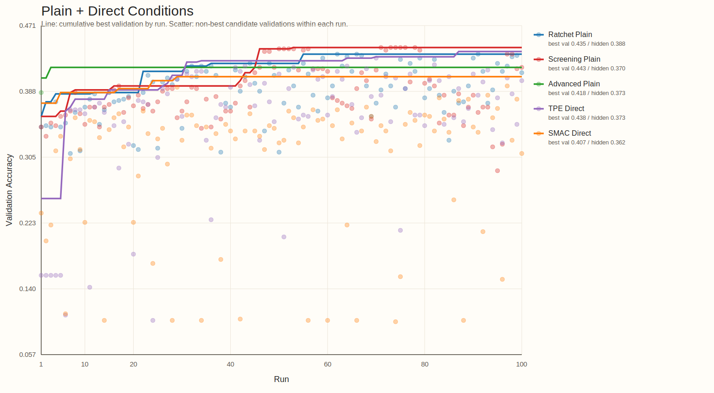
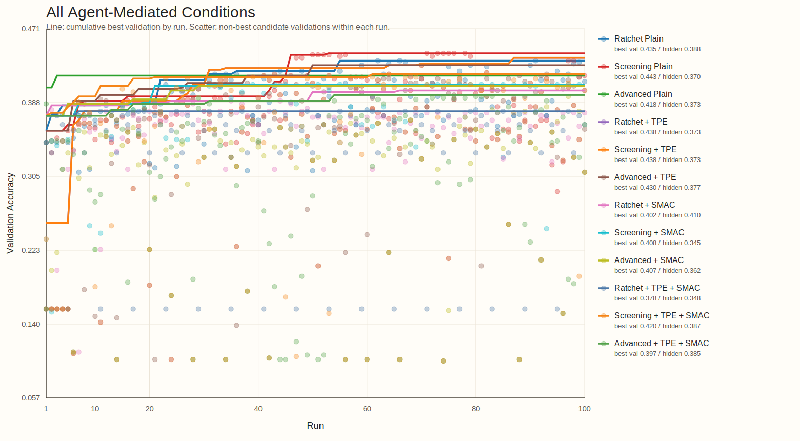

<!-- _class: title -->
<!-- footer: "" -->

# AutoML, Autoresearch, MLOps +@

26.4.8

서민교

---
<!-- footer: "AutoML 시작" -->

## 1. AutoML이란 무엇인가?

- 모델 개발 탐색 일부 자동화
- 대표 대상: `model selection`, `hyperparameter tuning`, `pipeline search`
- 핵심: 비교적 주어진 `search space` 안 최적 설정 탐색

---
<!-- footer: "NAS" -->

## 2. `Neural Architecture Search`는 AutoML의 확장이다

- parameter 대신 architecture 탐색
- AutoML의 `더 넓은 search space` 확장선
- 그래도 중심은 여전히 모델/파이프라인 후보 탐색

`hyperparameter search → pipeline search → architecture search`

---
<!-- footer: "Autoresearch의 등장" -->

## 3. `Autoresearch`는 어떻게 등장했고 무엇이 다른가?

- [karpathy/autoresearch](https://github.com/karpathy/autoresearch): 작은 training setup 위 `read → edit → run → keep-or-revert` loop 제시
- 연구 workflow 일부를 agent가 직접 수행하며, 설정 탐색을 넘어 `code`, `module`, `experiment` 자체 수정
- AutoML의 `fixed search space` 바깥으로 확장
- 이후 [RD-Agent](https://github.com/microsoft/RD-Agent), [AI-Scientist](https://github.com/SakanaAI/AI-Scientist), [GPT Researcher](https://github.com/assafelovic/gpt-researcher) 등으로 빠르게 확장

---
<!-- footer: "작업 흐름" -->

## 4. Agent 작업 흐름

- 코드 읽기, baseline 파악
- 작은 가설 하나 선택
- 학습 코드나 설정 수정
- 짧은 실험 실행, metric 확인
- 나쁘면 revert, 의미 있으면 keep
- 핵심: `edit 한 번`이 아니라 `짧은 실험 loop의 누적`

`Question → Read → Edit → Run → Analyze → Next experiment`

---
<!-- footer: "핵심 차이" -->

## 5. AutoML vs. Autoresearch

| 항목 | AutoML | Autoresearch |
| --- | --- | --- |
| 탐색 대상 | config, pipeline, architecture | hypothesis, code, module, experiment |
| 핵심 질문 | 어떤 설정이 가장 좋은가 | 다음에 어떤 실험을 해야 하는가 |
| edit 단위 | parameter / architecture | code / module / pipeline / experiment |
| 평가 방식 | objective 중심 | objective + reasoning + iteration |
| 위험 | 비효율적 탐색 | incoherent search, metric hacking |
| 필요한 인프라 | experiment infra | experiment + memory + harness |

---
<!-- footer: "사용례와 확장" -->

## 6. 사용례와 확장

사용례
- 문헌 조사 / deep research: [GPT Researcher](https://github.com/assafelovic/gpt-researcher)
- 코드 수정 + 실험 반복: [karpathy/autoresearch](https://github.com/karpathy/autoresearch), [RD-Agent](https://github.com/microsoft/RD-Agent)
- end-to-end 연구 자동화: [AI-Scientist](https://github.com/SakanaAI/AI-Scientist)

확장
- benchmark / evaluation: [MLE-bench](https://github.com/openai/mle-bench), [MLAgentBench](https://github.com/snap-stanford/MLAgentBench), [MLR-Bench](https://github.com/chchenhui/mlrbench)
- plugin / skill 생태계: [awesome-autoresearch](https://github.com/alvinreal/awesome-autoresearch), [Awesome Auto Research Tools](https://github.com/handsome-rich/Awesome-Auto-Research-Tools)
- memory, reusable modules, hardware fork

---
<!-- footer: "실험 관리 필요" -->

## 7. 체계적인 실험 관리의 필요

- 공통 문제: `많은 run` 비교와 누적
- 필수 요소: `tracking`, `lineage`, `orchestration`
- agent edit가 들어오면 `artifact`, `promotion`, `monitoring`, `cost control` 중요도 상승
- 결국 운영 문제

---
<!-- footer: "핵심 MLOps 요소" -->

## 8. AutoML과 Autoresearch가 공통으로 요구하는 MLOps 요소

| 요소 | AutoML에서의 역할 | Autoresearch에서의 역할 |
| --- | --- | --- |
| tracking | sweep 비교 | hypothesis / code edit history 비교 |
| orchestration | search job 실행 | agent + eval job 실행 |
| registry / lineage | best model 승격 | experiment / prompt / code provenance 보존 |
| monitoring / cost | retrain trigger, SLO | budget, drift, unsafe promotion guardrail |

---
<!-- footer: "Kubeflow lifecycle" -->

## 9. MLOps는 모델 개발, 관리, 배포 파이프라인을 유지 관리하는 작업이다

- Autoresearch loop는 이 큰 ML lifecycle 안의 일부
- 실제 시스템: `data`, `experiment`, `model registry`, `deployment`, `monitoring`
- 핵심 역할: `지속 운영`, `추적`, `승격`, `유지관리`

---
<!-- footer: "부족한 점" -->

## 10. Autoresearch의 단점

- 실험이 즉흥적으로 이어지기 쉬움
- 왜 이 실험을 했는지 attribution이 약함
- 큰 수정, 작은 튜닝, 검증 실험이 섞이기 쉬움
- robustness, replication, interaction 확인이 뒤로 밀림
- 잘 정리된 random search로 퇴화할 위험

---
<!-- footer: "필요한 harness" -->

## 11. 어떤 Harness가 필요한가

- 무엇을 먼저 볼지 정하는 우선순위
- 어떤 조합을 함께 볼지 정하는 규율
- 탐색 단계와 검증 단계 분리
- 작은 수정과 큰 수정을 다르게 다루는 운영 규칙
- 실패도 정보로 남기는 구조
- 다음 라운드를 설계하는 순차 실험 체계

---
<!-- footer: "DoE 개념" -->

## 12. Design of Experiments(DoE)란 무엇인가

- 여러 요인을 한 번에 바꿔 보며 effect를 읽는 실험 설계
- 한 번의 최고점보다 `요인`, `상호작용`, `안정성` 파악에 강점
- 핵심 질문: 무엇을 바꿨고, 무엇이 실제로 영향을 줬는가

---
<!-- footer: "빌려오는 DoE 개념" -->

## 13. DoE에서 빌려오는 개념

- `screening`: 중요한 요인부터 좁히기
- `factorial thinking`: interaction 보기
- `sequential design`: 라운드별 정교화
- `robust design`: 평균이 아니라 안정성까지 확인
- `mixture / allocation`: 예산과 비율 배분

---
<!-- footer: "비교 agents" -->

## 14. DoE-guided 운영과 비교한 Agents

| Agent | 운영 방식 | 특징 |
| --- | --- | --- |
| `01 Ratchet` | local ratchet loop | incumbent를 branch head로 두고 좁게 mutation |
| `02 Screening DoE` | simple screening | round마다 한 design question만 분리해 main effect를 읽음 |
| `03 Advanced DoE` | staged DoE program | screening → interaction check → local refinement |

---
<!-- footer: "실험 설정" -->

## 15. 실험 설정

| 항목 | 설정 |
| --- | --- |
| benchmark | `cifar10_real` |
| model | `mlp` |
| agent profiles | `Ratchet`, `Screening DoE`, `Advanced DoE` |
| advisor modes | `plain`, `TPE`, `SMAC`, `TPE+SMAC`, `TPE direct`, `SMAC direct` |
| isolated conditions | `14` |
| execution | root당 validation-history `100` runs + hidden finalize `1`회 |

실행 메모
- 각 condition은 subagent로 별도 root에서 독립 실행
- 최종 검산: finalized manifest `14`, run artifact `100 x 14`
- 이번 비교는 code-edit autoresearch가 아니라 bounded `AutoML + advisory harness` 비교다

탐색 축
- preprocessing: `normalization`, `outlier`, `projection`, `resampling`
- architecture: `hidden_dims`, `activation`, `normalization_layer`
- optimization: `solver`, `learning_rate`, `batch_size`, `max_iter`
- regularization / stability: `weight_decay`, `dropout`, `noise`, `label_smoothing`, `residual_connections`

---
<!-- footer: "결과 요약" -->

## 16. 최종 요약: validation 1등과 hidden 1등은 달랐다

| 관점 | 조건 | Best Val | Hidden Test |
| --- | --- | --- | --- |
| validation 최고 | `screening_plain` | `0.4433` | `0.3700` |
| hidden test 최고 | `ratchet_smac` | `0.4017` | `0.4100` |
| plain 조건 최고 hidden | `ratchet_plain` | `0.4350` | `0.3883` |
| direct 조건 최고 | `tpe_direct` | `0.4383` | `0.3733` |
| dual-advisor 최고 | `screening_tpe_smac` | `0.4200` | `0.3867` |

- `TPE`는 validation ceiling을 자주 올렸지만 hidden winner는 `SMAC` 쪽에서 나왔다.
- 이번 budget `100`에선 `TPE+SMAC` 조합이 단일 advisor를 안정적으로 이기지 못했다.

---
<!-- footer: "Plain + Direct Trace" -->

## 17. Plain + Direct 조건의 탐색 히스토리

- 선은 run별 cumulative best validation, 점은 같은 run의 non-best 후보다.
- `screening_plain`이 가장 높은 validation ceiling `0.4433`을 만들었다.
- `tpe_direct`는 빠르게 `0.4383`까지 올라왔지만 plain agent를 명확히 넘어서진 못했다.

---
<!-- footer: "Agent-Mediated Trace" -->

## 18. Agent-mediated 12개 조건의 탐색 히스토리

- `plain` 위에 `TPE`, `SMAC`, `TPE+SMAC` advisor를 얹은 12개 root를 비교했다.
- `Ratchet + SMAC`은 validation ceiling은 낮아도 hidden test `0.4100`으로 최종 일반화 최고였다.
- dual-advisor 조건은 점 분산이 컸고, 이번 batch에선 best-line 우위로 이어지지 않았다.

---
<!-- footer: "읽을 점" -->

## 19. 이번 batch에서 읽을 점

- `Screening DoE` plain이 validation 1등이었다. structured screening 자체가 약하지 않았다.
- `Ratchet + SMAC`이 hidden test 1등이었다. validation trace만으로 final winner를 정하면 miss가 생긴다.
- `TPE`는 여러 profile에서 같은 강한 incumbent로 수렴하며 ceiling lift 역할을 했다.
- advisor combination은 후보 다양성은 늘렸지만, 이번 budget에선 coordination cost가 더 컸다.

---
<!-- footer: "Harness Lesson" -->

## 20. Harness 관점에서 남는 교훈

- `best val`, `hidden finalize`, `artifact completeness`를 같이 봐야 한다.
- run count와 history row count를 혼동하면 early finalize가 생긴다.
- advisor trace에는 invalid proposal이 섞일 수 있어 log-domain과 search-space guard가 필요하다.
- isolate / finalize / history를 분리해야 mid-run best와 final winner를 동시에 읽을 수 있다.

---
<!-- footer: "한계" -->

## 21. 한계

- 단일 benchmark, single split batch라 분산 추정이 약하다.
- run budget `100`은 dual-advisor의 late gain을 보기엔 짧을 수 있다.
- hidden finalize는 final incumbent `1`회 기준이라 top-k reseeding은 아직 없다.
- code-edit autoresearch loop까지는 포함하지 않았다.

---
<!-- _class: tinytext -->
<!-- footer: "출처" -->

## 22. References

| 구분 | 예시 |
| --- | --- |
| curated landscape | [awesome-autoresearch](https://github.com/alvinreal/awesome-autoresearch), [Awesome Auto Research Tools](https://github.com/handsome-rich/Awesome-Auto-Research-Tools) |
| end-to-end systems | [karpathy/autoresearch](https://github.com/karpathy/autoresearch), [RD-Agent](https://github.com/microsoft/RD-Agent), [AI-Scientist](https://github.com/SakanaAI/AI-Scientist) |
| deep research | [GPT Researcher](https://github.com/assafelovic/gpt-researcher) |
| evaluation | [MLE-bench](https://github.com/openai/mle-bench), [MLAgentBench](https://github.com/snap-stanford/MLAgentBench), [MLR-Bench](https://github.com/chchenhui/mlrbench) |
| visuals | [AutoML image](https://miro.medium.com/v2/resize:fit:1382/1*ip8VpZ4_KJP8R5EwJ3zRgw.jpeg), [NAS image](https://i.ytimg.com/vi/_dR8a5ZcBgM/sddefault.jpg), [Kubeflow model registry lifecycle image](https://www.kubeflow.org/docs/components/model-registry/images/ml-lifecycle-kubeflow-modelregistry.drawio.svg) |
