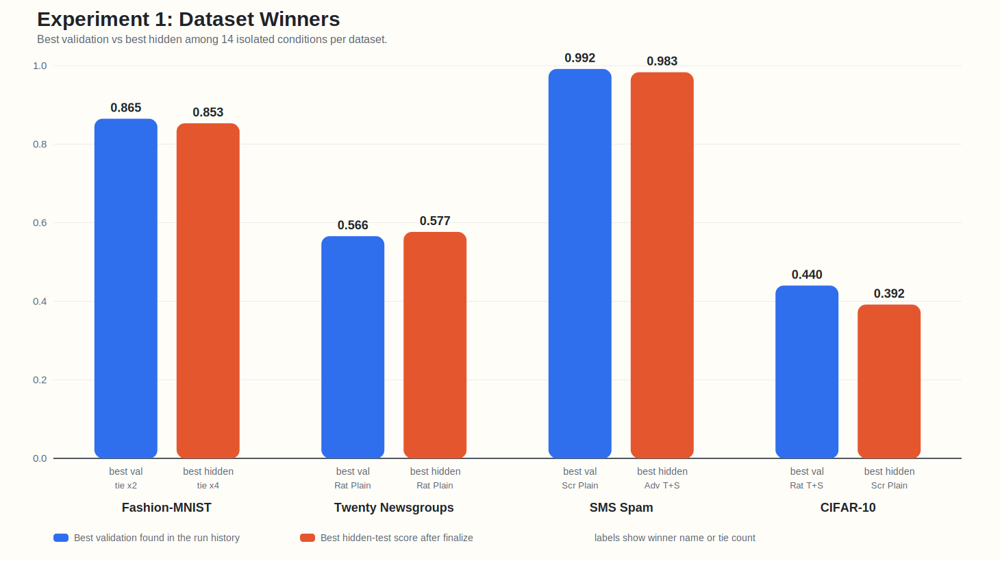
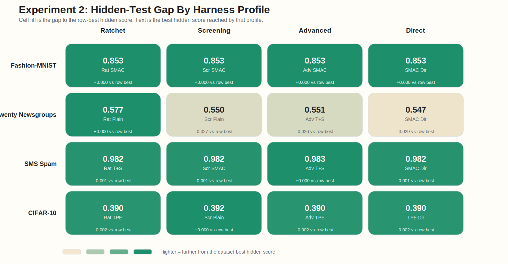

<!-- _class: title -->
<!-- footer: "" -->

# AutoML, Autoresearch, MLOps +@

26.4.8

서민교

---
<!-- footer: "AutoML" -->

## 1. AutoML

정의
- 주어진 `search space` 안에서 더 좋은 모델 설정을 자동으로 찾는 방법

대표 작업
- `model selection`, `hyperparameter tuning`, `pipeline search`

초점
- 새로운 알고리즘 자체보다 후보 비교와 설정 탐색 자동화

---
<!-- footer: "NAS" -->

## 2. Neural Architecture Search

- 설정값이 아니라 architecture 자체를 탐색
- AutoML의 `더 넓은 search space` 확장선
- 그래도 중심은 여전히 모델/파이프라인 후보 탐색

`hyperparameter search → pipeline search → architecture search`

---
<!-- footer: "Autoresearch" -->

## 3. Autoresearch

제안
- [karpathy/autoresearch](https://github.com/karpathy/autoresearch): 작은 training setup 위 `read → edit → run → keep-or-revert` loop 제시

- 연구 workflow 일부를 agent가 직접 수행하며, 설정 탐색을 넘어 `code`, `module`, `experiment` 자체 수정
- AutoML의 `fixed search space` 바깥으로 확장

이후 확장
- [RD-Agent](https://github.com/microsoft/RD-Agent), [AI-Scientist](https://github.com/SakanaAI/AI-Scientist), [GPT Researcher](https://github.com/assafelovic/gpt-researcher) 등으로 빠르게 확장

---
<!-- footer: "Workflow" -->

## 4. Autoresearch Workflow

`Read → Hypothesis → Edit → Run → Analyze → Next experiment`

`Read`
- baseline, failure mode, 제약을 파악한다

`Hypothesis`
- 다음 실험에서 검증할 질문 하나를 명시한다

`Edit`
- 작은 가설 하나를 코드나 설정에 반영한다

`Run`
- 짧은 실험으로 metric과 artifact를 확인한다

`Analyze`
- keep, revert, 다음 실험 제안으로 이어진다

---
<!-- footer: "핵심 차이" -->
<!-- _class: wide-table -->

## 5. AutoML vs. Autoresearch

| 항목 | AutoML | Autoresearch |
| --- | --- | --- |
| 탐색 대상 | config, pipeline, architecture | hypothesis, code, module, experiment |
| 핵심 질문 | 어떤 설정이 가장 좋은가 | 다음에 어떤 실험을 해야 하는가 |
| edit 단위 | parameter / architecture | code / module / pipeline / experiment |
| 평가 방식 | objective 중심 | objective + reasoning + iteration |
| 위험 | 비효율적 탐색 | incoherent search, metric hacking |
| 필요한 인프라 | experiment infra | experiment + memory + harness |

---
<!-- footer: "Applications" -->

## 6. Autoresearch Applications

사용례
- 문헌 조사 / deep research: [GPT Researcher](https://github.com/assafelovic/gpt-researcher)
- 코드 수정 + 실험 반복: [karpathy/autoresearch](https://github.com/karpathy/autoresearch), [RD-Agent](https://github.com/microsoft/RD-Agent)
- end-to-end 연구 자동화: [AI-Scientist](https://github.com/SakanaAI/AI-Scientist)

확장
- benchmark / evaluation: [MLE-bench](https://github.com/openai/mle-bench), [MLAgentBench](https://github.com/snap-stanford/MLAgentBench), [MLR-Bench](https://github.com/chchenhui/mlrbench)
- plugin / skill 생태계: [awesome-autoresearch](https://github.com/alvinreal/awesome-autoresearch), [Awesome Auto Research Tools](https://github.com/handsome-rich/Awesome-Auto-Research-Tools)

---
<!-- footer: "운영의 어려움" -->

## 7. 실험 운영의 어려움

공통 어려움
- `많은 run` 비교와 누적
- 어떤 edit가 차이를 만들었는지 추적하기 어렵다

agent 특유 문제
- `artifact`, `promotion`, `monitoring`, `cost control`까지 함께 관리해야 한다

---
<!-- footer: "MLOps" -->
<!-- _class: compact-mlops -->

## 8. MLOps

정의
- 모델 개발, 관리, 배포 파이프라인을 유지 관리하는 작업

필요성
- 앞 슬라이드의 실험 운영 문제를 시스템 수준에서 다룰 틀이 필요하다
- Autoresearch loop는 이 큰 ML lifecycle 안의 일부

핵심 역할
- `지속 운영`, `추적`, `승격`, `유지관리`

---
<!-- footer: "MLOps 요소" -->
<!-- _class: wide-table -->

## 9. MLOps 요소

| 요소 | AutoML에서의 역할 | Autoresearch에서의 역할 |
| --- | --- | --- |
| tracking | sweep 비교 | hypothesis / code edit history 비교 |
| orchestration | search job 실행 | agent + eval job 실행 |
| registry / lineage | best model 승격 | experiment / prompt / code provenance 보존 |
| monitoring / cost | retrain trigger, SLO | budget, drift, unsafe promotion guardrail |

---
<!-- footer: "두 질문" -->
<!-- _class: bigtext -->

## 10. 두 질문

성능
- `(AutoML의 도메인에서)` `Autoresearch`는 baseline보다 낫나

운영
- `Autoresearch`에 어떤 harness가 있으면 좋을까

---
<!-- footer: "질문 1 셋업" -->

## 11. 질문 1 셋업

| Arm | 의미 |
| --- | --- |
| baseline only | `Optuna TPE`, `SMAC3` |
| agent only | plain `Autoresearch` |
| hybrid | `agent + TPE`, `agent + SMAC3`, `agent + TPE+SMAC` |
| direct | `TPE direct`, `SMAC direct` |

---
<!-- _class: tinytext -->
<!-- footer: "관련 문헌" -->

## 12. 관련 문헌

- [Using Large Language Models for Hyperparameter Optimization](https://arxiv.org/abs/2312.04528)
  - 실험 이력 기반 순차 튜닝은 가능하지만, 장기적으로 BO 우위는 불명확하다.
- [LLAMBO: Large Language Models to Enhance Bayesian Optimization](https://arxiv.org/abs/2402.03921)
  - LLM은 BO를 대체하기보다 초기 탐색을 강화하는 보조 수단에 가깝다.
- [AgentHPO: Large Language Model Agent for Hyper-Parameter Optimization](https://arxiv.org/abs/2402.01881)
  - Agent형 LLM HPO는 가능성을 보였지만, BO 대비 성능 우위 근거는 약하다.
- [SLLMBO: Sequential Large Language Model-Based Hyper-parameter Optimization](https://arxiv.org/abs/2410.20302)
  - Hybrid LLM-BO 방식은 일부 태스크에서 classical BO보다 강하다.

---
<!-- footer: "Optuna TPE" -->

## 13. Optuna TPE

`Run History`
- observed trial을 `good set`과 `rest`로 나눈다

`Search Model`
- `l(x)`는 good set, `g(x)`는 rest의 density를 근사한다

`Selection Rule`
- `l(x) / g(x)`가 큰 후보를 다음 trial로 고른다

함의
- bounded space에서 빠르게 수렴하는 `exploit-heavy` baseline이다

<small>source: [Optuna TPESampler docs](https://optuna.readthedocs.io/en/v4.4.0/reference/samplers/generated/optuna.samplers.TPESampler.html)</small>

---
<!-- footer: "SMAC3" -->

## 14. SMAC3

`Run History`
- observed config-loss pair로 surrogate를 학습한다

`Search Model`
- surrogate는 mean과 uncertainty로 promising region을 예측한다

`Selection Rule`
- acquisition이 challenger를 고르고, intensifier가 incumbent와 붙인다

함의
- mixed, categorical, conditional space에서 강한 `model-based` baseline이다

<small>source: [SMAC3 docs](https://automl.github.io/SMAC3/main/), [Components](https://automl.github.io/SMAC3/v2.0.2/advanced_usage/1_components.html), [Intensifier](https://automl.github.io/SMAC3/v2.2.0/api/smac.intensifier.intensifier.html)</small>

---
<!-- footer: "질문 1 결과" -->

## 15. 질문 1 결과

- validation winner와 hidden-test winner는 `4`개 중 `3`개 데이터셋에서 갈렸다.
- 질문 1의 결론은 `better than baseline`이 아니라 `dataset-dependent portfolio`에 가깝다.

---
<!-- footer: "질문 2 셋업" -->

## 16. 질문 2 셋업

| 항목 | 설정 |
| --- | --- |
| benchmarks | `fashion`, `twenty`, `spam`, `cifar` |
| model | `mlp` |
| conditions | dataset당 `14` |
| budget | condition당 `100 + finalize 1` |

- 각 데이터셋은 fresh isolated root에서 다시 시작했다.
- 각 root 안에서 `14`개 condition마다 서로 다른 subagent를 띄웠다.
- 이번 질문은 `어떤 harness를 남길 것인가`다.

---
<!-- footer: "실행 규칙" -->

## 17. 실험 설정

| 항목 | 설정 |
| --- | --- |
| subagent isolation | condition별 독립 context |
| submission width | run당 `1` candidate |
| duplicate policy | 기존과 같은 config 금지 |
| validity gate | `100 runs + finalized 1` 검산 |

- context mixing과 repeated config를 막기 위해 실행 규칙을 강화했다.
- 첫 `twenty_newsgroups` wave는 contaminated run이라 버리고 clean rerun만 채택했다.

---
<!-- footer: "결과 매트릭스" -->

## 18. 탐색 축

| Dataset | best val | best hidden | signal |
| --- | --- | --- | --- |
| `fashion` | `advanced_tpe_smac` / `screening_tpe_smac` | `advanced_smac` tier | hybrid peak, `SMAC` finalize |
| `twenty` | `ratchet_plain` | `ratchet_plain` | plain exploit 승리 |
| `spam` | `screening_plain` | `advanced_tpe_smac` | saturated regime |
| `cifar` | `ratchet_tpe_smac` | `screening_plain` | peak와 finalize 분리 |

- 질문 2는 이 차이를 harness 관점에서 읽는 작업이다.

---
<!-- footer: "Fashion" -->

## 19. 결과 요약

| 관점 | 조건 | 점수 |
| --- | --- | --- |
| best val | `advanced_tpe_smac`, `screening_tpe_smac` | `0.865` |
| best hidden | `advanced_smac`, `ratchet_smac`, `screening_smac`, `smac_direct` | `0.853` |
| reading | peak는 hybrid, finalize는 `SMAC` 계열 |  |

- `fashion_mnist`에서는 model-based advisor가 late-stage generalization에 유리했다.
- direct `SMAC`도 top hidden tier에 들어서, agent만의 독점 우위는 아니었다.

---
<!-- footer: "Twenty" -->

## 20. Twenty 결과

| 관점 | 조건 | 점수 |
| --- | --- | --- |
| best val | `ratchet_plain` | `0.5658` |
| best hidden | `ratchet_plain` | `0.5767` |
| next tier | `advanced_tpe`, `ratchet_tpe`, `screening_tpe`, `tpe_direct` | `0.5458` hidden |

- `twenty_newsgroups`에서는 plain harness가 advisor를 붙인 변형보다 더 좋았다.
- 이 태스크에선 exploit loop 자체가 충분히 강했고, advisor가 추가 이득을 못 만들었다.

---
<!-- footer: "Spam" -->

## 21. Spam 결과

| 관점 | 조건 | 점수 |
| --- | --- | --- |
| best val | `screening_plain` | `0.9916` |
| best hidden | `advanced_tpe_smac` | `0.9833` |
| strong hidden tier | `smac_direct`, `advanced_smac`, `ratchet_smac`, `screening_smac`, `ratchet_tpe_smac` | `0.9821` |

- `sms_spam`은 거의 saturate돼서 validation 차이가 매우 작다.
- 이런 regime에선 `best val`보다 `finalize hidden`이 harness 판정에 더 중요하다.

---
<!-- footer: "CIFAR" -->

## 22. CIFAR 결과

| 관점 | 조건 | 점수 |
| --- | --- | --- |
| best val | `ratchet_tpe_smac` | `0.4400` |
| best hidden | `screening_plain` | `0.3917` |
| next hidden tier | `advanced_tpe`, `ratchet_tpe`, `screening_tpe`, `tpe_direct` | `0.3900` |

- `cifar10`에선 hybrid가 peak를 끌어올렸지만 finalize winner는 plain이었다.
- 따라서 search trace의 ceiling만 보면 harness를 잘못 고를 수 있다.

---
<!-- footer: "공통 패턴" -->

## 23. 공통 패턴

- winner는 dataset마다 달랐다.
- `best val`과 `best hidden`은 `fashion`, `spam`, `cifar`에서 갈렸다.
- hybrid가 ceiling을 높일 때도 있었지만, plain이 finalize를 더 잘하는 경우가 반복됐다.
- direct baseline도 여러 데이터셋에서 top tier에 남아 있었다.

---
<!-- footer: "Harness 해석" -->

## 24. Harness 해석

- `fashion`은 tie에 가깝고, `twenty`는 `ratchet`, `spam`은 `advanced`, `cifar`는 `screening`이 앞섰다.
- 즉 `무슨 advisor를 붙였나`만큼 `무슨 harness가 무엇을 보게 만들었나`가 중요했다.

---
<!-- footer: "운영 교훈" -->

## 25. 운영 교훈

- subagent isolation 없이는 dataset 간 context가 섞인다.
- run당 `1` candidate 제한이 없으면 비교 단위가 흐려진다.
- duplicate guard가 없으면 deterministic eval에서 같은 config를 반복하게 된다.
- artifact count로 검산하지 않으면 early finalize나 invalid wave를 놓친다.

---
<!-- footer: "핵심 함의" -->

## 26. 핵심 함의

- harness effect는 advisor effect만큼 컸다.
- validation 최적화와 finalize 최적화는 다른 문제였다.
- dual advisor는 일부 데이터셋에서만 이득이 있었다.
- harness 평가는 `best val`, `best hidden`, completeness를 함께 봐야 한다.

---
<!-- footer: "추천" -->

## 27. 운영 교훈

추천
- default winner 하나를 고정하지 말고 dataset별 shortlist를 운영한다.
- image tabular-like regime에선 hybrid peak를, text/saturated regime에선 plain finalize를 우선 본다.
- rerun 규칙과 contamination discard 기준을 미리 정해 둔다.

---
<!-- footer: "한계" -->

## 28. 한계

- single split, repeated seed 평균 없음
- model family는 `mlp` 하나만 사용했다
- budget은 condition당 `100 + finalize 1`로 짧다
- code-edit autoresearch와 open-ended research task는 아직 제외했다

---
<!-- _class: tinytext -->
<!-- footer: "출처" -->

## 29. References

| 구분 | 예시 |
| --- | --- |
| curated landscape | [awesome-autoresearch](https://github.com/alvinreal/awesome-autoresearch), [Awesome Auto Research Tools](https://github.com/handsome-rich/Awesome-Auto-Research-Tools) |
| end-to-end systems | [karpathy/autoresearch](https://github.com/karpathy/autoresearch), [RD-Agent](https://github.com/microsoft/RD-Agent), [AI-Scientist](https://github.com/SakanaAI/AI-Scientist) |
| deep research | [GPT Researcher](https://github.com/assafelovic/gpt-researcher) |
| evaluation | [MLE-bench](https://github.com/openai/mle-bench), [MLAgentBench](https://github.com/snap-stanford/MLAgentBench), [MLR-Bench](https://github.com/chchenhui/mlrbench) |
| optimization baselines | [Optuna docs](https://optuna.readthedocs.io/en/stable/reference/samplers/index.html), [SMAC3 docs](https://automl.github.io/SMAC3/main/) |
| visuals | [AutoML image](https://miro.medium.com/v2/resize:fit:1382/1*ip8VpZ4_KJP8R5EwJ3zRgw.jpeg), [NAS image](https://i.ytimg.com/vi/_dR8a5ZcBgM/sddefault.jpg), [Kubeflow model registry lifecycle image](https://www.kubeflow.org/docs/components/model-registry/images/ml-lifecycle-kubeflow-modelregistry.drawio.svg) |
