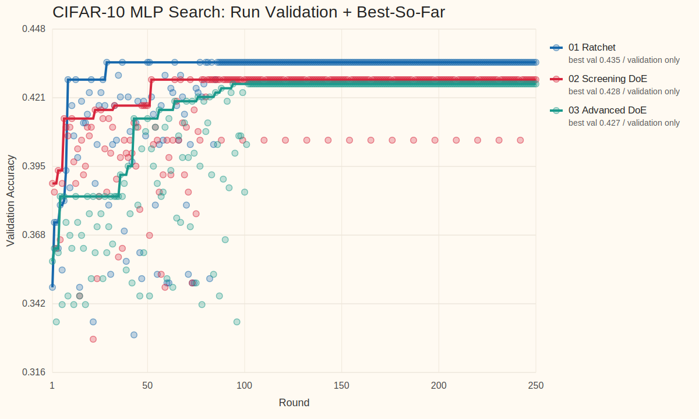
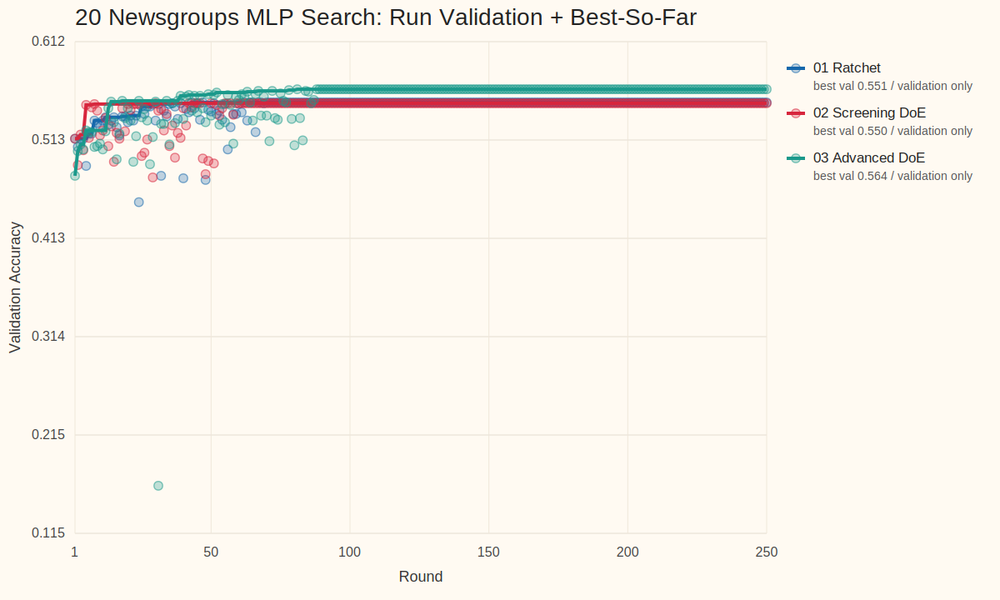

<!-- _class: title -->
<!-- footer: "" -->

# AutoML, Autoresearch, MLOps +@

26.4.8

서민교

---
<!-- footer: "AutoML 시작" -->

## 1. AutoML이란 무엇인가?

- 모델 개발 탐색 일부 자동화
- 대표 대상: `model selection`, `hyperparameter tuning`, `pipeline search`
- 핵심: 비교적 주어진 `search space` 안 최적 설정 탐색

---
<!-- footer: "NAS" -->

## 2. `Neural Architecture Search`는 AutoML의 확장이다

- parameter 대신 architecture 탐색
- AutoML의 `더 넓은 search space` 확장선
- 그래도 중심은 여전히 모델/파이프라인 후보 탐색

`hyperparameter search → pipeline search → architecture search`

---
<!-- footer: "Autoresearch의 등장" -->

## 3. `Autoresearch`는 어떻게 등장했고 무엇이 다른가?

- [karpathy/autoresearch](https://github.com/karpathy/autoresearch): 작은 training setup 위 `read → edit → run → keep-or-revert` loop 제시
- 연구 workflow 일부를 agent가 직접 수행하며, 설정 탐색을 넘어 `code`, `module`, `experiment` 자체 수정
- AutoML의 `fixed search space` 바깥으로 확장
- 이후 [RD-Agent](https://github.com/microsoft/RD-Agent), [AI-Scientist](https://github.com/SakanaAI/AI-Scientist), [GPT Researcher](https://github.com/assafelovic/gpt-researcher) 등으로 빠르게 확장

---
<!-- footer: "작업 흐름" -->

## 4. Agent 작업 흐름

- 코드 읽기, baseline 파악
- 작은 가설 하나 선택
- 학습 코드나 설정 수정
- 짧은 실험 실행, metric 확인
- 나쁘면 revert, 의미 있으면 keep
- 핵심: `edit 한 번`이 아니라 `짧은 실험 loop의 누적`

`Question → Read → Edit → Run → Analyze → Next experiment`

---
<!-- footer: "핵심 차이" -->

## 5. AutoML vs. Autoresearch

| 항목 | AutoML | Autoresearch |
| --- | --- | --- |
| 탐색 대상 | config, pipeline, architecture | hypothesis, code, module, experiment |
| 핵심 질문 | 어떤 설정이 가장 좋은가 | 다음에 어떤 실험을 해야 하는가 |
| edit 단위 | parameter / architecture | code / module / pipeline / experiment |
| 평가 방식 | objective 중심 | objective + reasoning + iteration |
| 위험 | 비효율적 탐색 | incoherent search, metric hacking |
| 필요한 인프라 | experiment infra | experiment + memory + harness |

---
<!-- footer: "사용례와 확장" -->

## 6. 사용례와 확장

사용례
- 문헌 조사 / deep research: [GPT Researcher](https://github.com/assafelovic/gpt-researcher)
- 코드 수정 + 실험 반복: [karpathy/autoresearch](https://github.com/karpathy/autoresearch), [RD-Agent](https://github.com/microsoft/RD-Agent)
- end-to-end 연구 자동화: [AI-Scientist](https://github.com/SakanaAI/AI-Scientist)

확장
- benchmark / evaluation: [MLE-bench](https://github.com/openai/mle-bench), [MLAgentBench](https://github.com/snap-stanford/MLAgentBench), [MLR-Bench](https://github.com/chchenhui/mlrbench)
- plugin / skill 생태계: [awesome-autoresearch](https://github.com/alvinreal/awesome-autoresearch), [Awesome Auto Research Tools](https://github.com/handsome-rich/Awesome-Auto-Research-Tools)
- memory, reusable modules, hardware fork

---
<!-- footer: "실험 관리 필요" -->

## 7. 체계적인 실험 관리의 필요

- 공통 문제: `많은 run` 비교와 누적
- 필수 요소: `tracking`, `lineage`, `orchestration`
- agent edit가 들어오면 `artifact`, `promotion`, `monitoring`, `cost control` 중요도 상승
- 결국 운영 문제

---
<!-- footer: "핵심 MLOps 요소" -->

## 8. AutoML과 Autoresearch가 공통으로 요구하는 MLOps 요소

| 요소 | AutoML에서의 역할 | Autoresearch에서의 역할 |
| --- | --- | --- |
| tracking | sweep 비교 | hypothesis / code edit history 비교 |
| orchestration | search job 실행 | agent + eval job 실행 |
| registry / lineage | best model 승격 | experiment / prompt / code provenance 보존 |
| monitoring / cost | retrain trigger, SLO | budget, drift, unsafe promotion guardrail |

---
<!-- footer: "Kubeflow lifecycle" -->

## 9. MLOps는 모델 개발, 관리, 배포 파이프라인을 유지 관리하는 작업이다

- Autoresearch loop는 이 큰 ML lifecycle 안의 일부
- 실제 시스템: `data`, `experiment`, `model registry`, `deployment`, `monitoring`
- 핵심 역할: `지속 운영`, `추적`, `승격`, `유지관리`

---
<!-- footer: "부족한 점" -->

## 10. Autoresearch의 단점

- 실험이 즉흥적으로 이어지기 쉬움
- 왜 이 실험을 했는지 attribution이 약함
- 큰 수정, 작은 튜닝, 검증 실험이 섞이기 쉬움
- robustness, replication, interaction 확인이 뒤로 밀림
- 잘 정리된 random search로 퇴화할 위험

---
<!-- footer: "필요한 harness" -->

## 11. 어떤 Harness가 필요한가

- 무엇을 먼저 볼지 정하는 우선순위
- 어떤 조합을 함께 볼지 정하는 규율
- 탐색 단계와 검증 단계 분리
- 작은 수정과 큰 수정을 다르게 다루는 운영 규칙
- 실패도 정보로 남기는 구조
- 다음 라운드를 설계하는 순차 실험 체계

---
<!-- footer: "DoE 개념" -->

## 12. Design of Experiments(DoE)란 무엇인가

- 여러 요인을 한 번에 바꿔 보며 effect를 읽는 실험 설계
- 한 번의 최고점보다 `요인`, `상호작용`, `안정성` 파악에 강점
- 핵심 질문: 무엇을 바꿨고, 무엇이 실제로 영향을 줬는가

---
<!-- footer: "빌려오는 DoE 개념" -->

## 13. DoE에서 빌려오는 개념

- `screening`: 중요한 요인부터 좁히기
- `factorial thinking`: interaction 보기
- `sequential design`: 라운드별 정교화
- `robust design`: 평균이 아니라 안정성까지 확인
- `mixture / allocation`: 예산과 비율 배분

---
<!-- footer: "비교 agents" -->

## 14. DoE-guided 운영과 비교한 Agents

| Agent | 운영 방식 | 특징 |
| --- | --- | --- |
| `01 Ratchet` | local ratchet loop | incumbent를 branch head로 두고 좁게 mutation |
| `02 Screening DoE` | simple screening | round마다 한 design question만 분리해 main effect를 읽음 |
| `03 Advanced DoE` | staged DoE program | screening → interaction check → local refinement |

---
<!-- footer: "실험 설정" -->

## 15. 실험 설정

| 항목 | 설정 |
| --- | --- |
| benchmarks | `cifar10_real`, `twenty_newsgroups_real` |
| data budget | CIFAR-10 `4k`, 20 Newsgroups `8k` |
| model | `mlp` |
| agents | `01 Ratchet`, `02 Screening DoE`, `03 Advanced DoE` |
| execution | dataset × agent isolated root `6`, validation-only `250` runs |

실행 메모
- root별 독립 실행 + subagent 분리, 최신 `program.md`와 refactored runner 기준
- 이번 비교는 전처리·MLP 구조·최적화 축을 보는 bounded `AutoML` test이며, `AutoAgent`처럼 코드 전체를 다루는 실험은 아니다

탐색 축
- preprocessing: `normalization`, `outlier`, `projection`, `resampling`
- architecture: `hidden_dims`, `activation`, `normalization_layer`
- optimization: `solver`, `learning_rate`, `batch_size`, `max_iter`
- regularization / stability: `weight_decay`, `dropout`, `noise`, `label_smoothing`, `residual_connections`

---
<!-- footer: "결과 테이블" -->

## 16. CIFAR-10 결과: validation 탐색

조건: `cifar10_real` / `mlp` / `program.md` batch / validation `250` runs

| Agent | Best Val | Run of Best | Gain vs Run1 | Incumbent Updates | Plateau Tail |
| --- | --- | --- | --- | --- | --- |
| `01 Ratchet` | `0.4350` | `29` | `+0.0867` | `7` | `221` |
| `02 Screening DoE` | `0.4283` | `52` | `+0.0400` | `6` | `198` |
| `03 Advanced DoE` | `0.4267` | `94` | `+0.0683` | `12` | `156` |

대표 incumbent
- `01 Ratchet`: `standard + clip_iqr + [128,64] + elu + adamw + wd=1e-4 + lr=1e-4 + bs=64`
- `02 Screening DoE`: `standard + clip_percentile + [128,64] + gelu + adam + wd=2.5e-3 + lr=1e-4 + bs=64`
- `03 Advanced DoE`: `standard + clip_iqr + [128,64] + gelu + adam + wd=2.5e-3 + lr=1e-4 + bs=64`

---
<!-- footer: "탐색 궤적" -->

## 17. CIFAR-10 결과: 탐색 궤적

- `Ratchet`이 가장 높은 ceiling을 만들었다.
- `Screening DoE`는 중반까지 꾸준히 오르지만 최종 최고점은 낮다.
- `Advanced DoE`는 가장 늦게 best를 갱신했지만, `run 94` 이후 추가 이득은 없었다.

---
<!-- footer: "CIFAR 해석" -->

## 18. CIFAR-10 해석

- CIFAR에선 `Ratchet`이 가장 높은 최고점을 냈다.
- `Advanced DoE`는 최고점은 약간 낮지만 가장 긴 탐색 수명을 보였다.
- 추가 `150` runs가 새 best를 만들지는 못했다.

---
<!-- footer: "Text 결과" -->

## 19. 20 Newsgroups 결과: validation 탐색

조건: `twenty_newsgroups_real` / `mlp` / `program.md` batch / validation `250` runs

| Agent | Best Val | Run of Best | Gain vs Run1 | Incumbent Updates | Plateau Tail |
| --- | --- | --- | --- | --- | --- |
| `01 Ratchet` | `0.5508` | `43` | `+0.0367` | `10` | `207` |
| `02 Screening DoE` | `0.5500` | `30` | `+0.0358` | `5` | `220` |
| `03 Advanced DoE` | `0.5642` | `81` | `+0.0875` | `15` | `169` |

대표 incumbent
- `01 Ratchet`: `maxabs + [64,32] + leaky_relu + adamw + wd=5e-4 + lr=1e-4 + bs=32`
- `02 Screening DoE`: `standard + [128,64] + tanh + adamw + wd=1e-3 + lr=1e-3 + bs=64`
- `03 Advanced DoE`: `robust + [128,64] + relu + adamw + wd=0 + lr=1e-4 + bs=64`

---
<!-- footer: "Text 궤적" -->

## 20. 20 Newsgroups 결과: 탐색 궤적

- text에선 `Advanced DoE`가 후반까지 꾸준히 incumbent를 갱신했다.
- `Ratchet`도 중반까지는 강했지만 late gain은 작았다.
- `Screening DoE`는 초반 screen 이후 매우 긴 plateau로 들어갔다.

---
<!-- footer: "Text 해석" -->

## 21. 20 Newsgroups 해석

- text에선 `Advanced DoE`가 가장 높은 최고점과 가장 많은 incumbent update를 만들었다.
- `Ratchet`은 strong local search로는 충분했지만 late exploration은 약했다.
- `Screening DoE`는 초반 우선순위화에는 유용했지만 full-budget owner로는 약했다.
- 여기서도 추가 `150` runs는 기존 best를 뒤집지 못했다.

---
<!-- footer: "지식 추출" -->

## 22. 히스토리에서 남는 지식

`01 Ratchet`
- 강한 incumbent가 보이면 빠르게 붙잡는다.
- local exploit에는 강하지만 late reset 효율은 낮다.

`02 Screening DoE`
- factor 우선순위화에는 유용하다.
- screening 이후 refine로 못 넘어가면 plateau가 길어진다.

`03 Advanced DoE`
- staged search가 실제 candidate diversity로 이어질 수 있었다.
- 특히 text에서 late-stage refinement 효과가 가장 컸다.

---
<!-- footer: "히스토리 진단" -->

## 23. 히스토리 진단

| Agent | CIFAR trace | Text trace | 읽을 점 |
| --- | --- | --- | --- |
| `Ratchet` | best `run 29`, updates `7` | best `run 43`, updates `10` | local ratchet은 유지됐지만 late jump는 약함 |
| `Screening DoE` | best `run 52`, updates `6` | best `run 30`, updates `5` | one-factor screen은 있으나 refine 전환이 약함 |
| `Advanced DoE` | best `run 94`, updates `12` | best `run 81`, updates `15` | staged program이 실제 late improvement로 연결됨 |

- 이번 batch에선 세 전략 차이가 실제 trace에 남았다.
- 다만 `250`까지 늘려도 모든 최고점은 `100` 이전에 이미 결정됐다.

---
<!-- footer: "요약" -->

## 24. 요약

- CIFAR best: `01 Ratchet`, `val 0.4350`
- Text best: `03 Advanced DoE`, `val 0.5642`
- `Screening DoE`는 front-end screening으로는 유효했지만 full-budget owner로는 약했다.
- 이번 `250-run` batch는 전략 차이를 보여주되, 추가 예산의 한계도 같이 보여준다.

---
<!-- footer: "한계" -->

## 25. 한계

- 이번 정리는 validation-only batch다. hidden finalize는 아직 안 했다.
- single split 기준이라 분산 추정이 약하다.
- fixed subset 위 실험이라 전체 분포 대표성은 제한적이다.
- text는 fixed TF-IDF representation 위 실험이다.
- `program.md` 차이를 더 강하게 보려면 multi-seed confirmation이나 hidden test까지 이어야 한다.

---
<!-- _class: tinytext -->
<!-- footer: "출처" -->

## 26. References

| 구분 | 예시 |
| --- | --- |
| curated landscape | [awesome-autoresearch](https://github.com/alvinreal/awesome-autoresearch), [Awesome Auto Research Tools](https://github.com/handsome-rich/Awesome-Auto-Research-Tools) |
| end-to-end systems | [karpathy/autoresearch](https://github.com/karpathy/autoresearch), [RD-Agent](https://github.com/microsoft/RD-Agent), [AI-Scientist](https://github.com/SakanaAI/AI-Scientist) |
| deep research | [GPT Researcher](https://github.com/assafelovic/gpt-researcher) |
| evaluation | [MLE-bench](https://github.com/openai/mle-bench), [MLAgentBench](https://github.com/snap-stanford/MLAgentBench), [MLR-Bench](https://github.com/chchenhui/mlrbench) |
| visuals | [AutoML image](https://miro.medium.com/v2/resize:fit:1382/1*ip8VpZ4_KJP8R5EwJ3zRgw.jpeg), [NAS image](https://i.ytimg.com/vi/_dR8a5ZcBgM/sddefault.jpg), [Kubeflow model registry lifecycle image](https://www.kubeflow.org/docs/components/model-registry/images/ml-lifecycle-kubeflow-modelregistry.drawio.svg) |
