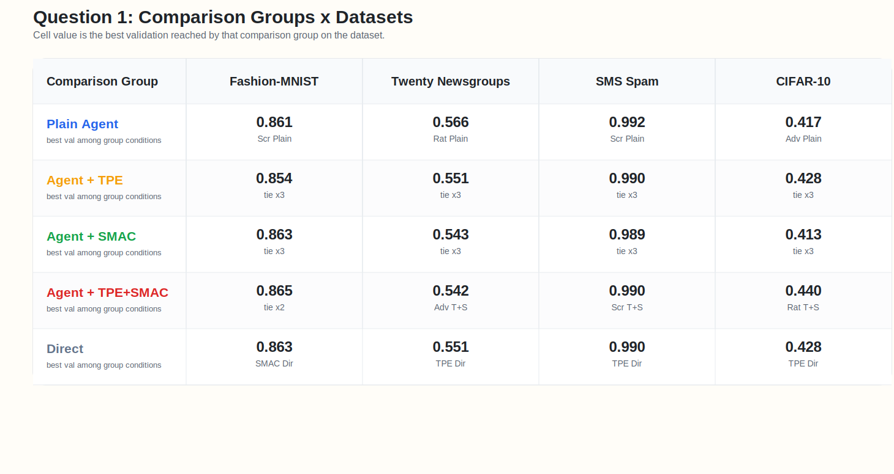
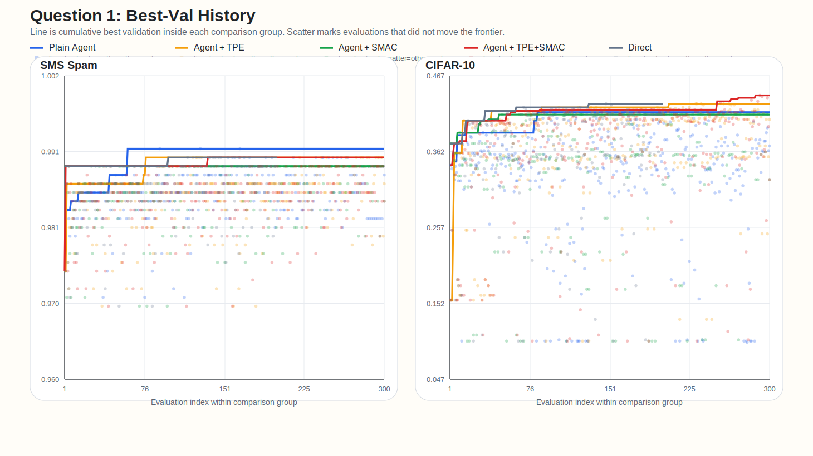
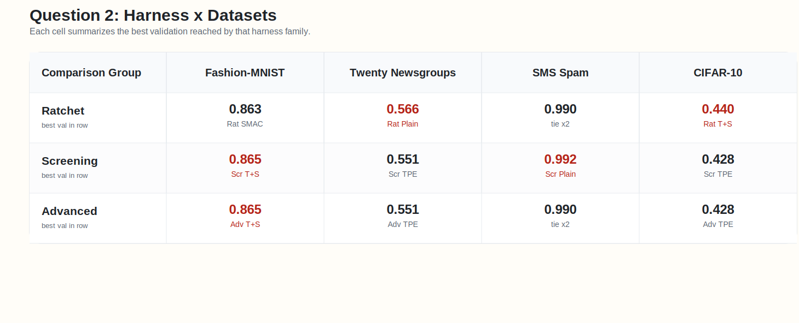
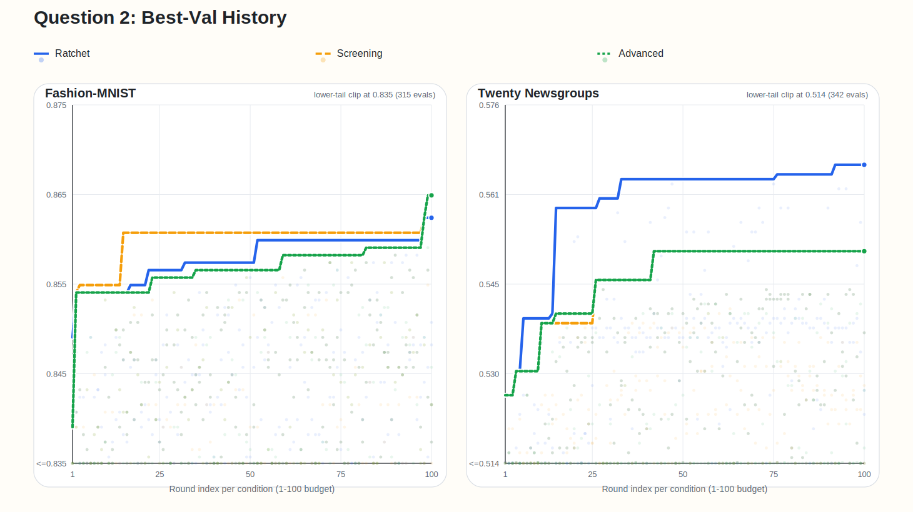
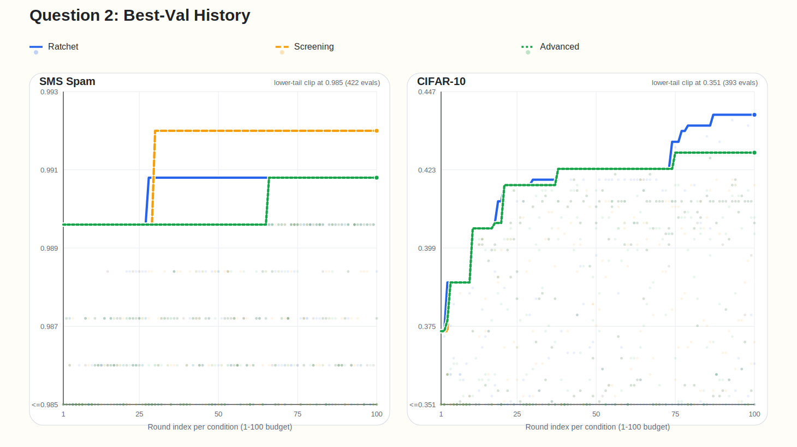

<!-- _class: title -->
<!-- footer: "" -->

# AutoML, Autoresearch, MLOps +@

4.10

서민교

---
<!-- footer: "AutoML" -->

## 1. AutoML

정의
- 주어진 `search space` 안에서 더 좋은 모델 설정을 자동으로 찾는 방법

대표 작업
- `model selection`, `hyperparameter tuning`, `pipeline search`

초점
- 새로운 알고리즘 자체보다 후보 비교와 설정 탐색 자동화

---
<!-- footer: "NAS" -->

## 2. Neural Architecture Search

- 설정값이 아니라 architecture 자체를 탐색
- AutoML의 `더 넓은 search space` 확장선
- 그래도 중심은 여전히 모델/파이프라인 후보 탐색

`hyperparameter search → pipeline search → architecture search`

---
<!-- footer: "Autoresearch" -->

## 3. Autoresearch

제안
- [karpathy/autoresearch](https://github.com/karpathy/autoresearch): 작은 training setup 위 `read → edit → run → keep-or-revert` loop 제시

- 연구 workflow 일부를 agent가 직접 수행하며, 설정 탐색을 넘어 `code`, `module`, `experiment` 자체 수정
- AutoML의 `fixed search space` 바깥으로 확장

이후 확장
- [RD-Agent](https://github.com/microsoft/RD-Agent), [AI-Scientist](https://github.com/SakanaAI/AI-Scientist), [GPT Researcher](https://github.com/assafelovic/gpt-researcher) 등으로 빠르게 확장

---
<!-- footer: "Workflow" -->

## 4. Autoresearch Workflow

`Read → Hypothesis → Edit → Run → Analyze → Next experiment`

`Read`
- baseline, failure mode, 제약을 파악한다

`Hypothesis`
- 다음 실험에서 검증할 질문 하나를 명시한다

`Edit`
- 작은 가설 하나를 코드나 설정에 반영한다

`Run`
- 짧은 실험으로 metric과 artifact를 확인한다

`Analyze`
- keep, revert, 다음 실험 제안으로 이어진다

---
<!-- footer: "핵심 차이" -->
<!-- _class: wide-table -->

## 5. AutoML vs. Autoresearch

| 항목 | AutoML | Autoresearch |
| --- | --- | --- |
| 탐색 대상 | config, pipeline, architecture | hypothesis, code, module, experiment |
| 핵심 질문 | 어떤 설정이 가장 좋은가 | 다음에 어떤 실험을 해야 하는가 |
| edit 단위 | parameter / architecture | code / module / pipeline / experiment |
| 평가 방식 | objective 중심 | objective + reasoning + iteration |
| 위험 | 비효율적 탐색 | incoherent search, metric hacking |
| 필요한 인프라 | experiment infra | experiment + memory + harness |

---
<!-- footer: "Applications" -->

## 6. Autoresearch Applications

사용례
- 문헌 조사 / deep research: [GPT Researcher](https://github.com/assafelovic/gpt-researcher)
- 코드 수정 + 실험 반복: [karpathy/autoresearch](https://github.com/karpathy/autoresearch), [RD-Agent](https://github.com/microsoft/RD-Agent)
- end-to-end 연구 자동화: [AI-Scientist](https://github.com/SakanaAI/AI-Scientist)

확장
- benchmark / evaluation: [MLE-bench](https://github.com/openai/mle-bench), [MLAgentBench](https://github.com/snap-stanford/MLAgentBench), [MLR-Bench](https://github.com/chchenhui/mlrbench)
- plugin / skill 생태계: [awesome-autoresearch](https://github.com/alvinreal/awesome-autoresearch), [Awesome Auto Research Tools](https://github.com/handsome-rich/Awesome-Auto-Research-Tools)

---
<!-- footer: "운영의 어려움" -->

## 7. 실험 운영의 어려움

공통 어려움
- `많은 run` 비교와 누적
- 어떤 edit가 차이를 만들었는지 추적하기 어렵다

agent 특유 문제
- `artifact`, `promotion`, `monitoring`, `cost control`까지 함께 관리해야 한다

---
<!-- footer: "MLOps" -->
<!-- _class: compact-mlops -->

## 8. MLOps

정의
- 모델 개발, 관리, 배포 파이프라인을 유지 관리하는 작업

필요성
- Autoresearch loop는 이 큰 ML lifecycle 안의 일부

핵심 역할
- `지속 운영`, `추적`, `승격`, `유지관리`

---
<!-- footer: "MLOps 요소" -->
<!-- _class: wide-table -->

## 9. MLOps 요소

| 요소 | AutoML에서의 역할 | Autoresearch에서의 역할 |
| --- | --- | --- |
| tracking | sweep 비교 | hypothesis / code edit history 비교 |
| orchestration | search job 실행 | agent + eval job 실행 |
| registry / lineage | best model 승격 | experiment / prompt / code provenance 보존 |
| monitoring / cost | retrain trigger, SLO | budget, drift, unsafe promotion guardrail |

---
<!-- footer: "두 질문" -->
<!-- _class: bigtext -->

## 10. 두 질문

성능
- `(AutoML의 도메인에서)` `Autoresearch`는 baseline보다 낫나

운영
- `Autoresearch`에 어떤 harness가 있으면 좋을까

---
<!-- footer: "질문 1 셋업" -->

## 11. 질문 1 셋업

비교 항목

| Method | 구성 |
| --- | --- |
| `TPE Direct` | `Optuna TPE`가 직접 candidate 제안 |
| `SMAC Direct` | `SMAC3`가 직접 candidate 제안 |
| `Plain Agent` | advisor 없이 plain `Autoresearch` 실행 |

실험 환경
- benchmarks: `fashion`, `twenty`, `spam`, `cifar`
- model: fixed `mlp` search space
- readout: `best val`, frontier trajectory

---
<!-- _class: reftext -->
<!-- footer: "관련 문헌" -->

## 12. 관련 문헌

- [Using Large Language Models for Hyperparameter Optimization](https://arxiv.org/abs/2312.04528)
  - 실험 이력 기반 순차 튜닝은 가능하지만, 장기적으로 BO 우위는 불명확하다.
- [LLAMBO: Large Language Models to Enhance Bayesian Optimization](https://arxiv.org/abs/2402.03921)
  - LLM은 BO를 대체하기보다 초기 탐색을 강화하는 보조 수단에 가깝다.
- [AgentHPO: Large Language Model Agent for Hyper-Parameter Optimization](https://arxiv.org/abs/2402.01881)
  - Agent형 LLM HPO는 가능성을 보였지만, BO 대비 성능 우위 근거는 약하다.
- [SLLMBO: Sequential Large Language Model-Based Hyper-parameter Optimization](https://arxiv.org/abs/2410.20302)
  - Hybrid LLM-BO 방식은 일부 태스크에서 classical BO보다 강하다.

---
<!-- footer: "Optuna TPE" -->

## 13. Optuna TPE

`핵심 직관`
- 지난 trial을 `상위권`과 `나머지`로 나눈다

`다음 점`
- 상위권이 자주 나오고 나머지는 덜 나오는 구간을 다시 찍는다

`읽는 법`
- "좋은 점수들이 몰린 자리"를 density로 찾는 sampler다

---
<!-- footer: "SMAC3" -->

## 14. SMAC3

`핵심 직관`
- 과거 평가 기록으로 `싸게 예측하는 대리모델`을 만든다

`다음 점`
- 평균이 좋아 보이거나 불확실성이 큰 challenger를 먼저 뽑는다

`비교 방식`
- incumbent와 짧게 붙여 보고, 이길 가능성이 있으면 budget을 더 준다

---
<!-- footer: "질문 1 표" -->

## 15. 질문 1 표

- 질문 1은 `Plain Agent`와 `TPE/SMAC direct`를 같은 dataset set에서 비교한 표다. winner는 여전히 dataset마다 갈린다.
- 그래서 baseline 비교의 결론은 단일 champion보다 dataset별 shortlist에 가깝다.

---
<!-- footer: "질문 1 추적 A" -->

## 16. 질문 1 추적 A

- `fashion`과 `twenty`의 frontier 모양이 다르다. `fashion`은 direct baseline이 late gain을 만들었고, `twenty`는 `Plain Agent`가 초반 우위를 끝까지 지켰다.

---
<!-- footer: "질문 1 추적 B" -->

## 17. 질문 1 추적 B

- `spam`은 조기 포화, `cifar`는 긴 plateau 뒤 late jump가 반복됐다. 같은 budget이어도 direct와 agent의 유불리가 dataset마다 달라진다.

---
<!-- footer: "질문 2 셋업" -->

## 18. 질문 2 셋업

비교 축

| Harness | loop | 초점 |
| --- | --- | --- |
| `Ratchet` | incumbent 중심 exploit | 빠른 local climb |
| `Screening` | factor screening | main effect 분리 |
| `Advanced` | staged DOE | 다음 round 설계 |

실험 환경
- datasets: `fashion`, `twenty`, `spam`, `cifar`
- variants: 각 harness 안에서 `plain`, `TPE`, `SMAC`, `TPE+SMAC`
- readout: `best val`, frontier trajectory

---
<!-- footer: "질문 2 요약" -->

## 19. 질문 2 요약

- harness 비교도 dataset마다 달랐다. 즉 `무슨 advisor를 붙였나`만으로는 결과를 설명할 수 없고, `어떤 search loop를 돌렸나`가 별도 요인이다.

---
<!-- footer: "Fashion, Twenty" -->

## 20. Fashion, Twenty

- `fashion`에선 `screening/advanced`가 frontier를 올렸고, `twenty`에선 `ratchet`가 초반 exploit 우위를 유지했다.

---
<!-- footer: "Spam, CIFAR" -->

## 21. Spam, CIFAR

- `spam`은 `screening`, `cifar`는 `ratchet`가 상단 frontier를 만들었다. harness는 해석 틀이 아니라 실제 search policy다.

---
<!-- footer: "공통 패턴" -->

## 22. 공통 패턴

- winner는 dataset마다 달랐다.
- 같은 top score라도 frontier shape와 late gain 위치는 dataset마다 달랐다.
- hybrid가 ceiling을 높일 때도 있었지만, plain이 finalize를 더 잘하는 경우가 반복됐다.
- direct baseline도 여러 데이터셋에서 top tier에 남아 있었다.

---
<!-- footer: "운영 교훈" -->

## 23. 운영 교훈

- subagent isolation 없이는 dataset 간 context가 섞인다.
- run당 `1` candidate 제한이 없으면 비교 단위가 흐려진다.
- duplicate guard가 없으면 deterministic eval에서 같은 config를 반복하게 된다.
- artifact count로 검산하지 않으면 early finalize나 invalid wave를 놓친다.

---
<!-- footer: "핵심 함의" -->

## 24. 핵심 함의

- harness effect는 advisor effect만큼 컸다.
- validation 최적화와 finalize 최적화는 다른 문제였다.
- dual advisor는 일부 데이터셋에서만 이득이 있었다.
- harness 평가는 `best val`, frontier, completeness를 함께 봐야 한다.

---
<!-- footer: "추천" -->

## 25. 추천

추천
- default winner 하나를 고정하지 말고 dataset별 shortlist를 운영한다.
- image tabular-like regime에선 hybrid peak를, text/saturated regime에선 plain finalize를 우선 본다.
- rerun 규칙과 contamination discard 기준을 미리 정해 둔다.

---
<!-- footer: "한계" -->

## 26. 한계

- single split, repeated seed 평균 없음
- model family는 `mlp` 하나만 사용했다
- budget은 condition당 `100 + finalize 1`로 짧다
- code-edit autoresearch와 open-ended research task는 아직 제외했다

---
<!-- _class: tinytext -->
<!-- footer: "출처" -->

## 27. References

| 구분 | 예시 |
| --- | --- |
| curated landscape | [awesome-autoresearch](https://github.com/alvinreal/awesome-autoresearch), [Awesome Auto Research Tools](https://github.com/handsome-rich/Awesome-Auto-Research-Tools) |
| end-to-end systems | [karpathy/autoresearch](https://github.com/karpathy/autoresearch), [RD-Agent](https://github.com/microsoft/RD-Agent), [AI-Scientist](https://github.com/SakanaAI/AI-Scientist) |
| deep research | [GPT Researcher](https://github.com/assafelovic/gpt-researcher) |
| evaluation | [MLE-bench](https://github.com/openai/mle-bench), [MLAgentBench](https://github.com/snap-stanford/MLAgentBench), [MLR-Bench](https://github.com/chchenhui/mlrbench) |
| optimization baselines | [Optuna docs](https://optuna.readthedocs.io/en/stable/reference/samplers/index.html), [SMAC3 docs](https://automl.github.io/SMAC3/main/) |
| visuals | [AutoML image](https://miro.medium.com/v2/resize:fit:1382/1*ip8VpZ4_KJP8R5EwJ3zRgw.jpeg), [NAS image](https://i.ytimg.com/vi/_dR8a5ZcBgM/sddefault.jpg), [Kubeflow model registry lifecycle image](https://www.kubeflow.org/docs/components/model-registry/images/ml-lifecycle-kubeflow-modelregistry.drawio.svg) |
