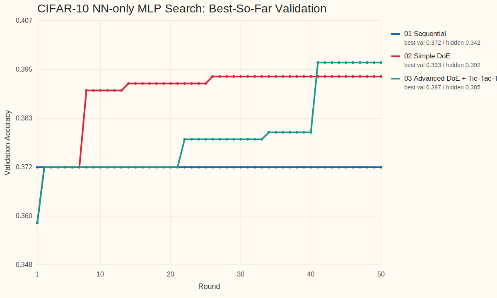

<!-- _class: title -->
<!-- footer: "" -->

# AutoML, Autoresearch, MLOps +@

26.4.7

서민교

---
<!-- footer: "AutoML 시작" -->

## 1. AutoML이란 무엇인가?

- 모델 개발 탐색 일부 자동화
- 대표 대상: `model selection`, `hyperparameter tuning`, `pipeline search`
- 핵심: 비교적 주어진 `search space` 안 최적 설정 탐색

---
<!-- footer: "NAS" -->

## 2. `Neural Architecture Search`는 AutoML의 확장이다

- parameter 대신 architecture 탐색
- AutoML의 `더 넓은 search space` 확장선
- 그래도 중심은 여전히 모델/파이프라인 후보 탐색

`hyperparameter search → pipeline search → architecture search`

---
<!-- footer: "Autoresearch의 등장" -->

## 3. `Autoresearch`는 어떻게 등장했고 무엇이 다른가?

- [karpathy/autoresearch](https://github.com/karpathy/autoresearch): 작은 training setup 위 `read → edit → run → keep-or-revert` loop 제시
- 연구 workflow 일부를 agent가 직접 수행하며, 설정 탐색을 넘어 `code`, `module`, `experiment` 자체 수정
- AutoML의 `fixed search space` 바깥으로 확장
- 이후 [RD-Agent](https://github.com/microsoft/RD-Agent), [AI-Scientist](https://github.com/SakanaAI/AI-Scientist), [GPT Researcher](https://github.com/assafelovic/gpt-researcher) 등으로 빠르게 확장

---
<!-- footer: "작업 흐름" -->

## 4. Agent 작업 흐름

- 코드 읽기, baseline 파악
- 작은 가설 하나 선택
- 학습 코드나 설정 수정
- 짧은 실험 실행, metric 확인
- 나쁘면 revert, 의미 있으면 keep
- 핵심: `edit 한 번`이 아니라 `짧은 실험 loop의 누적`

`Question → Read → Edit → Run → Analyze → Next experiment`

---
<!-- footer: "핵심 차이" -->

## 5. AutoML vs. Autoresearch

| 항목 | AutoML | Autoresearch |
| --- | --- | --- |
| 탐색 대상 | config, pipeline, architecture | hypothesis, code, module, experiment |
| 핵심 질문 | 어떤 설정이 가장 좋은가 | 다음에 어떤 실험을 해야 하는가 |
| edit 단위 | parameter / architecture | code / module / pipeline / experiment |
| 평가 방식 | objective 중심 | objective + reasoning + iteration |
| 위험 | 비효율적 탐색 | incoherent search, metric hacking |
| 필요한 인프라 | experiment infra | experiment + memory + harness |

---
<!-- footer: "사용례와 확장" -->

## 6. 사용례와 확장

사용례
- 문헌 조사 / deep research: [GPT Researcher](https://github.com/assafelovic/gpt-researcher)
- 코드 수정 + 실험 반복: [karpathy/autoresearch](https://github.com/karpathy/autoresearch), [RD-Agent](https://github.com/microsoft/RD-Agent)
- end-to-end 연구 자동화: [AI-Scientist](https://github.com/SakanaAI/AI-Scientist)

확장
- benchmark / evaluation: [MLE-bench](https://github.com/openai/mle-bench), [MLAgentBench](https://github.com/snap-stanford/MLAgentBench), [MLR-Bench](https://github.com/chchenhui/mlrbench)
- plugin / skill 생태계: [awesome-autoresearch](https://github.com/alvinreal/awesome-autoresearch), [Awesome Auto Research Tools](https://github.com/handsome-rich/Awesome-Auto-Research-Tools)
- memory, reusable modules, hardware fork

---
<!-- footer: "실험 관리 필요" -->

## 7. 체계적인 실험 관리의 필요

- 공통 문제: `많은 run` 비교와 누적
- 필수 요소: `tracking`, `lineage`, `orchestration`
- agent edit가 들어오면 `artifact`, `promotion`, `monitoring`, `cost control` 중요도 상승
- 결국 운영 문제

---
<!-- footer: "핵심 MLOps 요소" -->

## 8. AutoML과 Autoresearch가 공통으로 요구하는 MLOps 요소

| 요소 | AutoML에서의 역할 | Autoresearch에서의 역할 |
| --- | --- | --- |
| tracking | sweep 비교 | hypothesis / code edit history 비교 |
| orchestration | search job 실행 | agent + eval job 실행 |
| registry / lineage | best model 승격 | experiment / prompt / code provenance 보존 |
| monitoring / cost | retrain trigger, SLO | budget, drift, unsafe promotion guardrail |

---
<!-- footer: "Kubeflow lifecycle" -->

## 9. MLOps는 모델 개발, 관리, 배포 파이프라인을 유지 관리하는 작업이다

- Autoresearch loop는 이 큰 ML lifecycle 안의 일부
- 실제 시스템: `data`, `experiment`, `model registry`, `deployment`, `monitoring`
- 핵심 역할: `지속 운영`, `추적`, `승격`, `유지관리`

---
<!-- footer: "부족한 점" -->

## 10. Autoresearch의 단점

- 실험이 즉흥적으로 이어지기 쉬움
- 왜 이 실험을 했는지 attribution이 약함
- 큰 수정, 작은 튜닝, 검증 실험이 섞이기 쉬움
- robustness, replication, interaction 확인이 뒤로 밀림
- 잘 정리된 random search로 퇴화할 위험

---
<!-- footer: "필요한 harness" -->

## 11. 어떤 Harness가 필요한가

- 무엇을 먼저 볼지 정하는 우선순위
- 어떤 조합을 함께 볼지 정하는 규율
- 탐색 단계와 검증 단계 분리
- 작은 수정과 큰 수정을 다르게 다루는 운영 규칙
- 실패도 정보로 남기는 구조
- 다음 라운드를 설계하는 순차 실험 체계

---
<!-- footer: "DoE 개념" -->

## 12. Design of Experiments(DoE)란 무엇인가

- 여러 요인을 한 번에 바꿔 보며 effect를 읽는 실험 설계
- 한 번의 최고점보다 `요인`, `상호작용`, `안정성` 파악에 강점
- 핵심 질문: 무엇을 바꿨고, 무엇이 실제로 영향을 줬는가

---
<!-- footer: "빌려오는 DoE 개념" -->

## 13. DoE에서 빌려오는 개념

- `screening`: 중요한 요인부터 좁히기
- `factorial thinking`: interaction 보기
- `sequential design`: 라운드별 정교화
- `robust design`: 평균이 아니라 안정성까지 확인
- `mixture / allocation`: 예산과 비율 배분

---
<!-- footer: "비교 agents" -->

## 14. DoE-guided 운영과 비교한 Agents

| Agent | 운영 방식 | 특징 |
| --- | --- | --- |
| `01 Sequential` | Vanilla autoresearch | 최신 기록에 맞춰 작은 변경을 순차 적용 |
| `02 Simple DoE` | DoE-guided screening | factor와 level을 두고 screening 중심 비교 |
| `03 Advanced DoE Tic-Tac-To` | DoE-guided staged program | staged DoE + 실험 타입 예산 분배 |

- `Tic / Tac / To`: 다중 모듈 변경 / 단일 모듈 교체 / 같은 구조 안 수치 조정, 목표 비율 `1:2:4`

---
<!-- footer: "실험 설정" -->

## 15. 실험 설정

| 항목 | 설정 |
| --- | --- |
| benchmark | `cifar10_real` |
| data budget | `max_samples=4000`, fixed split seed `42` |
| model | `mlp` |
| agents | `01 Sequential`, `02 Simple DoE`, `03 Advanced DoE + Tic-Tac-To` |
| execution | agent별 isolated root에서 validation `50` rounds 후 hidden finalize |

실행 조건
- agent별 isolated root를 따로 만들어 context leakage 없이 독립 실행
- 같은 start control에서 출발해 validation-only `50` runs 누적
- hidden test는 탐색 종료 뒤 `finalize-agent`에서만 공개

NN-only curated search surface: `8` knobs
- preprocessing: `normalization`
- model structure: `hidden_dims`
- optimization: `activation`, `solver`, `learning_rate_init`, `batch_size`
- regularization / norm: `normalization_layer`, `weight_decay`

고정한 convention
- `projection = none`, `outlier_strategy = none`, `resampling = none`
- `early_stopping = true`, `max_iter = 120`, `learning_rate = constant`

---
<!-- _class: tinytext -->
<!-- footer: "결과 테이블" -->

## 16. 결과: validation 탐색과 hidden test

조건: `cifar10_real` / `mlp` / curated `8` knobs / validation `50` runs + hidden finalize

| Agent | Best Val | Hidden Test | Gap | Run of Best | Incumbent Updates |
| --- | --- | --- | --- | --- | --- |
| `01 Sequential` | `0.3717` | `0.3417` | `0.0300` | `1` | `1` |
| `02 Simple DoE` | `0.3933` | `0.3917` | `0.0017` | `26` | `5` |
| `03 Advanced DoE + Tic-Tac-To` | `0.3967` | `0.3850` | `0.0117` | `41` | `5` |

대표 config
- `01 Sequential`: `standard + [64,32] + relu + adam + no internal norm + wd=0.0005 + lr=0.001 + bs=64`
- `02 Simple DoE`: `standard + [64,64,64] + relu + adam + batchnorm + wd=0.001 + lr=0.001 + bs=32`
- `03 Advanced DoE + Tic-Tac-To`: `maxabs + [32,64] + leaky_relu + adam + layernorm + wd=0.0008 + lr=0.0012 + bs=128`

---
<!-- footer: "탐색 궤적" -->

## 17. 결과: 탐색 궤적

- `Sequential`: round `1`에서 best를 잡은 뒤 끝까지 incumbent를 못 넘겼다.
- `Simple DoE`: screening 뒤 `26` round에서 best를 찾고 hidden에서도 거의 그대로 유지했다.
- `Advanced DoE + Tic-Tac-To`: `41` round까지 개선을 이어갔고, 실제 move count는 `Tic:Tac:To = 7:14:28`로 `1:2:4`에 거의 맞았다.

---
<!-- footer: "히스토리 해석" -->

## 18. 히스토리에서 읽히는 결론

- validation 최고점은 `Advanced DoE + Tic-Tac-To`였지만 hidden 최고점은 `Simple DoE`였다.
- `Sequential`은 첫 incumbent를 빠르게 잡았지만, one-factor local loop가 그대로 굳어져 탐색이 사실상 멈췄다.
- `Simple DoE`는 screening으로 좋은 basin을 찾은 뒤, 그 basin이 hidden에서도 거의 그대로 유지됐다.
- `Advanced DoE + Tic-Tac-To`는 가장 풍부한 validation basin을 찾았지만, interaction-heavy refinement가 validation noise를 더 쫓은 흔적도 남겼다.
- 이 batch에선 "누가 validation을 가장 높였나"보다 "누가 transfer되는 prior를 남겼나"가 더 중요했다.

---
<!-- footer: "지식 추출 1" -->

## 19. 히스토리와 피드백에서 추출한 튜닝 지식

`01 Sequential`
- 강한 prior: `standard` normalization이 시작점 `maxabs`보다 바로 우세했다.
- 약한 branch: `tanh`, 추가 width 변경, `layernorm`은 incumbent를 넘지 못했다.
- 프로세스 지식: 첫 incumbent가 moderate local optimum일 때, 순차 one-factor loop는 쉽게 고착된다.

`02 Simple DoE`
- 강한 prior: `standard + [64,64,64] + relu + adam + batchnorm + wd=0.001 + lr=0.001 + bs=32`
- 가장 중요한 성질은 hidden gap이 `0.0017`로 매우 작았다는 점이다.
- 프로세스 지식: factor screening이 잘 되면, paired anchor/probe만으로도 transferable prior를 만들 수 있다.

---
<!-- footer: "지식 추출 2" -->

## 20. 히스토리와 피드백에서 추출한 튜닝 지식

`03 Advanced DoE + Tic-Tac-To`
- 강한 prior: `maxabs + [32,64] + leaky_relu + adam + layernorm + wd=0.0008 + lr=0.0012 + bs=128`
- interaction 지식: `standard`로 scale을 바꾸거나 internal norm을 제거하면 성능이 눈에 띄게 무너졌다.
- 예산 지식: 실제 move count `7:14:28`로 `Tic:Tac:To ≈ 1:2:4`를 거의 지켰다.
- 다만 hidden gap이 `0.0117`이라, richer exploration이 항상 better transfer를 보장하진 않았다.

메타 지식
- `history.md`와 `feedback.md`는 다음 benchmark에 재사용할 `configuration prior`와 `search policy prior` 원천이다.
- DOE 계열은 `hypothesis / factors / levels / conclusion` 구조 덕분에 지식 추출이 쉽고, hidden 결과와 함께 보면 prior의 신뢰도까지 평가할 수 있다.

---
<!-- footer: "한계" -->

## 21. 한계

- 이번 결과는 `cifar10_real` subset `4000`과 single split 기준이라 분산 추정이 약하다.
- hidden test도 agent당 한 번만 열었으므로, replication이나 confidence interval은 없다.
- search space를 `8` knobs로 강하게 줄였기 때문에 DOE의 장점이 일부 과소평가될 수 있다.
- 반대로 이 정도로 좁은 space에서도 `Sequential`이 쉽게 고착됐다는 점은 autoresearch loop 자체의 취약점이다.
- larger benchmark나 text benchmark로 가면 ranking이 달라질 수 있다.

---
<!-- _class: tinytext -->
<!-- footer: "출처" -->

## 22. References

| 구분 | 예시 |
| --- | --- |
| curated landscape | [awesome-autoresearch](https://github.com/alvinreal/awesome-autoresearch), [Awesome Auto Research Tools](https://github.com/handsome-rich/Awesome-Auto-Research-Tools) |
| end-to-end systems | [karpathy/autoresearch](https://github.com/karpathy/autoresearch), [RD-Agent](https://github.com/microsoft/RD-Agent), [AI-Scientist](https://github.com/SakanaAI/AI-Scientist) |
| deep research | [GPT Researcher](https://github.com/assafelovic/gpt-researcher) |
| evaluation | [MLE-bench](https://github.com/openai/mle-bench), [MLAgentBench](https://github.com/snap-stanford/MLAgentBench), [MLR-Bench](https://github.com/chchenhui/mlrbench) |
| visuals | [AutoML image](https://miro.medium.com/v2/resize:fit:1382/1*ip8VpZ4_KJP8R5EwJ3zRgw.jpeg), [NAS image](https://i.ytimg.com/vi/_dR8a5ZcBgM/sddefault.jpg), [Kubeflow model registry lifecycle image](https://www.kubeflow.org/docs/components/model-registry/images/ml-lifecycle-kubeflow-modelregistry.drawio.svg) |
