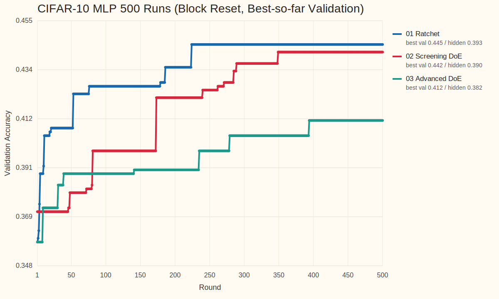
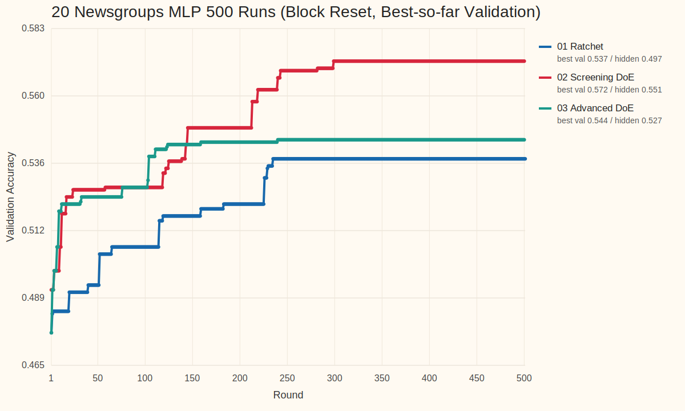

<!-- _class: title -->
<!-- footer: "" -->

# AutoML, Autoresearch, MLOps +@

26.4.8

서민교

---
<!-- footer: "AutoML 시작" -->

## 1. AutoML이란 무엇인가?

- 모델 개발 탐색 일부 자동화
- 대표 대상: `model selection`, `hyperparameter tuning`, `pipeline search`
- 핵심: 비교적 주어진 `search space` 안 최적 설정 탐색

---
<!-- footer: "NAS" -->

## 2. `Neural Architecture Search`는 AutoML의 확장이다

- parameter 대신 architecture 탐색
- AutoML의 `더 넓은 search space` 확장선
- 그래도 중심은 여전히 모델/파이프라인 후보 탐색

`hyperparameter search → pipeline search → architecture search`

---
<!-- footer: "Autoresearch의 등장" -->

## 3. `Autoresearch`는 어떻게 등장했고 무엇이 다른가?

- [karpathy/autoresearch](https://github.com/karpathy/autoresearch): 작은 training setup 위 `read → edit → run → keep-or-revert` loop 제시
- 연구 workflow 일부를 agent가 직접 수행하며, 설정 탐색을 넘어 `code`, `module`, `experiment` 자체 수정
- AutoML의 `fixed search space` 바깥으로 확장
- 이후 [RD-Agent](https://github.com/microsoft/RD-Agent), [AI-Scientist](https://github.com/SakanaAI/AI-Scientist), [GPT Researcher](https://github.com/assafelovic/gpt-researcher) 등으로 빠르게 확장

---
<!-- footer: "작업 흐름" -->

## 4. Agent 작업 흐름

- 코드 읽기, baseline 파악
- 작은 가설 하나 선택
- 학습 코드나 설정 수정
- 짧은 실험 실행, metric 확인
- 나쁘면 revert, 의미 있으면 keep
- 핵심: `edit 한 번`이 아니라 `짧은 실험 loop의 누적`

`Question → Read → Edit → Run → Analyze → Next experiment`

---
<!-- footer: "핵심 차이" -->

## 5. AutoML vs. Autoresearch

| 항목 | AutoML | Autoresearch |
| --- | --- | --- |
| 탐색 대상 | config, pipeline, architecture | hypothesis, code, module, experiment |
| 핵심 질문 | 어떤 설정이 가장 좋은가 | 다음에 어떤 실험을 해야 하는가 |
| edit 단위 | parameter / architecture | code / module / pipeline / experiment |
| 평가 방식 | objective 중심 | objective + reasoning + iteration |
| 위험 | 비효율적 탐색 | incoherent search, metric hacking |
| 필요한 인프라 | experiment infra | experiment + memory + harness |

---
<!-- footer: "사용례와 확장" -->

## 6. 사용례와 확장

사용례
- 문헌 조사 / deep research: [GPT Researcher](https://github.com/assafelovic/gpt-researcher)
- 코드 수정 + 실험 반복: [karpathy/autoresearch](https://github.com/karpathy/autoresearch), [RD-Agent](https://github.com/microsoft/RD-Agent)
- end-to-end 연구 자동화: [AI-Scientist](https://github.com/SakanaAI/AI-Scientist)

확장
- benchmark / evaluation: [MLE-bench](https://github.com/openai/mle-bench), [MLAgentBench](https://github.com/snap-stanford/MLAgentBench), [MLR-Bench](https://github.com/chchenhui/mlrbench)
- plugin / skill 생태계: [awesome-autoresearch](https://github.com/alvinreal/awesome-autoresearch), [Awesome Auto Research Tools](https://github.com/handsome-rich/Awesome-Auto-Research-Tools)
- memory, reusable modules, hardware fork

---
<!-- footer: "실험 관리 필요" -->

## 7. 체계적인 실험 관리의 필요

- 공통 문제: `많은 run` 비교와 누적
- 필수 요소: `tracking`, `lineage`, `orchestration`
- agent edit가 들어오면 `artifact`, `promotion`, `monitoring`, `cost control` 중요도 상승
- 결국 운영 문제

---
<!-- footer: "핵심 MLOps 요소" -->

## 8. AutoML과 Autoresearch가 공통으로 요구하는 MLOps 요소

| 요소 | AutoML에서의 역할 | Autoresearch에서의 역할 |
| --- | --- | --- |
| tracking | sweep 비교 | hypothesis / code edit history 비교 |
| orchestration | search job 실행 | agent + eval job 실행 |
| registry / lineage | best model 승격 | experiment / prompt / code provenance 보존 |
| monitoring / cost | retrain trigger, SLO | budget, drift, unsafe promotion guardrail |

---
<!-- footer: "Kubeflow lifecycle" -->

## 9. MLOps는 모델 개발, 관리, 배포 파이프라인을 유지 관리하는 작업이다

- Autoresearch loop는 이 큰 ML lifecycle 안의 일부
- 실제 시스템: `data`, `experiment`, `model registry`, `deployment`, `monitoring`
- 핵심 역할: `지속 운영`, `추적`, `승격`, `유지관리`

---
<!-- footer: "부족한 점" -->

## 10. Autoresearch의 단점

- 실험이 즉흥적으로 이어지기 쉬움
- 왜 이 실험을 했는지 attribution이 약함
- 큰 수정, 작은 튜닝, 검증 실험이 섞이기 쉬움
- robustness, replication, interaction 확인이 뒤로 밀림
- 잘 정리된 random search로 퇴화할 위험

---
<!-- footer: "필요한 harness" -->

## 11. 어떤 Harness가 필요한가

- 무엇을 먼저 볼지 정하는 우선순위
- 어떤 조합을 함께 볼지 정하는 규율
- 탐색 단계와 검증 단계 분리
- 작은 수정과 큰 수정을 다르게 다루는 운영 규칙
- 실패도 정보로 남기는 구조
- 다음 라운드를 설계하는 순차 실험 체계

---
<!-- footer: "DoE 개념" -->

## 12. Design of Experiments(DoE)란 무엇인가

- 여러 요인을 한 번에 바꿔 보며 effect를 읽는 실험 설계
- 한 번의 최고점보다 `요인`, `상호작용`, `안정성` 파악에 강점
- 핵심 질문: 무엇을 바꿨고, 무엇이 실제로 영향을 줬는가

---
<!-- footer: "빌려오는 DoE 개념" -->

## 13. DoE에서 빌려오는 개념

- `screening`: 중요한 요인부터 좁히기
- `factorial thinking`: interaction 보기
- `sequential design`: 라운드별 정교화
- `robust design`: 평균이 아니라 안정성까지 확인
- `mixture / allocation`: 예산과 비율 배분

---
<!-- footer: "비교 agents" -->

## 14. DoE-guided 운영과 비교한 Agents

| Agent | 운영 방식 | 특징 |
| --- | --- | --- |
| `01 Ratchet` | local ratchet loop | incumbent를 branch head로 두고 좁게 mutation |
| `02 Screening DoE` | simple screening | round마다 한 design question만 분리해 main effect를 읽음 |
| `03 Advanced DoE` | staged DoE program | screening → interaction check → local refinement |

---
<!-- footer: "실험 설정" -->

## 15. 실험 설정

| 항목 | 설정 |
| --- | --- |
| benchmarks | `cifar10_real`, `twenty_newsgroups_real` |
| data budget | CIFAR-10 `max_samples=4000`, 20 Newsgroups `max_samples=8000` |
| model | `mlp` |
| agents | `01 Ratchet`, `02 Screening DoE`, `03 Advanced DoE` |
| execution | dataset × agent별 isolated root `6`개에서 validation `500` runs 후 hidden finalize |

실행 조건
- agent별 isolated root를 따로 만들어 context leakage 없이 독립 실행
- `50-run` block마다 새 subagent를 붙여 context를 reset
- validation-only `500` runs를 먼저 누적하고 hidden test는 마지막 `finalize-agent`에서만 공개
- 이번 batch는 넓어진 MLP search surface를 사용

열려 있는 주요 축
- preprocessing: `normalization`, `outlier`, `projection`, `resampling`
- architecture: `hidden_dims`, `activation`, `normalization_layer`
- optimization: `solver`, `learning_rate`, `batch_size`, `max_iter`
- regularization / stability: `weight_decay`, `dropout`, `noise`, `label_smoothing`, `residual_connections`

---
<!-- footer: "결과 테이블" -->

## 16. CIFAR-10 결과: validation 탐색과 hidden test

조건: `cifar10_real` / `mlp` / block-reset execution / validation `500` runs + hidden finalize

| Agent | Best Val | Hidden Test | Gap | Run of Best | Incumbent Updates |
| --- | --- | --- | --- | --- | --- |
| `01 Ratchet` | `0.4450` | `0.3933` | `0.0517` | `224` | `14` |
| `02 Screening DoE` | `0.4417` | `0.3900` | `0.0517` | `349` | `13` |
| `03 Advanced DoE` | `0.4117` | `0.3817` | `0.0300` | `394` | `8` |

대표 config
- `01 Ratchet`: `maxabs + [128,128,64] + relu + sgd(adaptive,nesterov) + wd=5e-4 + lr=0.021 + bs=64`
- `02 Screening DoE`: `maxabs + clip_percentile + [64,32] + relu + adam + batchnorm + wd=5e-3 + lr=6.3e-5 + bs=128`
- `03 Advanced DoE`: `maxabs + [128,128,64] + relu + adam + wd=2e-4 + lr=0.0018 + bs=128`

---
<!-- footer: "탐색 궤적" -->

## 17. CIFAR-10 결과: 탐색 궤적

- `Ratchet`은 중반까지 개선을 이어가며 가장 높은 CIFAR validation과 hidden을 남겼다.
- `Screening DoE`는 늦게까지 개선했지만 Ratchet을 넘지는 못했다.
- `Advanced DoE`는 이전 batch보다 일찍 plateau에 들어가 이번 설정에선 우세를 만들지 못했다.

---
<!-- footer: "CIFAR 해석" -->

## 18. CIFAR-10 해석

- block reset과 stricter loop hygiene를 넣자 CIFAR winner는 `Ratchet`으로 바뀌었다.
- 이번 search space에선 staged DOE보다 강한 local exploitation이 더 유리했다.
- `Screening DoE`는 좋은 basin까지는 갔지만 후반 ceiling이 낮았다.
- `Advanced DoE`는 gap은 가장 작았지만 absolute performance는 가장 낮았다.

---
<!-- footer: "Text 결과" -->

## 19. 20 Newsgroups 결과: validation 탐색과 hidden test

조건: `twenty_newsgroups_real` / `mlp` / block-reset execution / validation `500` runs + hidden finalize

| Agent | Best Val | Hidden Test | Gap | Run of Best | Incumbent Updates |
| --- | --- | --- | --- | --- | --- |
| `01 Ratchet` | `0.5375` | `0.4967` | `0.0408` | `235` | `15` |
| `02 Screening DoE` | `0.5717` | `0.5508` | `0.0208` | `299` | `19` |
| `03 Advanced DoE` | `0.5442` | `0.5275` | `0.0167` | `240` | `16` |

대표 config
- `01 Ratchet`: `maxabs + [64,64] + tanh + adamw + layernorm + xavier_uniform + wd=5.86e-4 + lr=0.00119 + bs=64`
- `02 Screening DoE`: `robust + oversample_minority + [128,64] + leaky_relu + adam + xavier_normal + dropout + residual + warmup=16`
- `03 Advanced DoE`: `robust + [32] + relu + adam + wd=5e-5 + lr=7.85e-4 + bs=145`

---
<!-- footer: "Text 궤적" -->

## 20. 20 Newsgroups 결과: 탐색 궤적

- `Screening DoE`는 중반에 winner를 확정하고 끝까지 hidden에서도 유지했다.
- `Advanced DoE`는 꾸준히 개선했지만 screening을 넘지 못했다.
- `Ratchet`은 val은 올렸지만 hidden gap이 가장 컸다.

---
<!-- footer: "Text 해석" -->

## 21. 20 Newsgroups 해석

- text에서는 이번에도 `Screening DoE`가 가장 강했다.
- robust scaling, oversampling, 중간 폭 MLP, 작은 warmup이 강한 prior로 남았다.
- `Advanced DoE`는 안정적이었지만 screening의 early win을 뒤집지는 못했다.
- `Ratchet`은 hidden gap이 가장 커서 generalization 측면에서 불리했다.

---
<!-- footer: "지식 추출" -->

## 22. 히스토리에서 남는 지식

`01 Ratchet`
- CIFAR에서는 강한 incumbent basin을 붙잡고 끝까지 미는 전략이 실제로 가장 강했다.
- text에서는 좋은 basin은 찾았지만 hidden gap이 커서 confirmation quality가 약했다.
- reset을 넣어도 local exploitation 편향은 여전히 강하다.

`02 Screening DoE`
- text prior: `robust + oversampling + leaky_relu/adam + small warmup` 계열이 강하다.
- CIFAR에서는 `clip_percentile`와 작은 MLP branch가 끝까지 살아남았다.
- 두 dataset 모두 hidden에서도 비교적 안정적이었다.

`03 Advanced DoE`
- CIFAR에서는 이번 batch에서 payoff가 크지 않았다.
- text에서는 꾸준한 개선은 만들었지만 screening의 top basin은 못 넘었다.
- staged refinement가 항상 최고점으로 이어지지는 않는다는 반례로 읽힌다.

---
<!-- footer: "히스토리 진단" -->

## 23. 히스토리 진단

| Agent | CIFAR trace | Text trace | 읽을 점 |
| --- | --- | --- | --- |
| `Ratchet` | best `run 224`, updates `14` | best `run 235`, updates `15` | block reset 뒤에는 긴 예산도 실제 개선으로 연결됐다 |
| `Screening DoE` | best `run 349`, updates `13` | best `run 299`, updates `19` | screening이 생각보다 오래 유효했고 hidden도 가장 안정적이었다 |
| `Advanced DoE` | best `run 394`, updates `8` | best `run 240`, updates `16` | 이번 batch에선 staged design이 winner를 만들지는 못했다 |

- 이번 batch에서는 초기 trap보다 `후반 예산을 누가 더 잘 쓰는가`가 더 중요했다.
- block reset을 넣자 세 agent 모두 장기 탐색 품질은 개선됐다.
- 하지만 dataset별 winner는 달랐다. CIFAR는 ratchet, text는 screening이었다.

---
<!-- footer: "요약" -->

## 24. 요약

- CIFAR winner: `01 Ratchet`, val `0.4450`, test `0.3933`
- Text winner: `02 Screening DoE`, val `0.5717`, test `0.5508`
- block reset을 넣은 이번 batch에서는 이전 결론이 일부 뒤집혔다.
- 같은 `mlp`라도 dataset이 바뀌면 좋은 harness가 달라졌다.

---
<!-- footer: "한계" -->

## 25. 한계

- 이번 결과는 single split 기준이라 분산 추정이 약하다.
- hidden test도 agent당 한 번만 열었으므로 replication이나 confidence interval은 없다.
- fixed subset 위 실험이라 dataset 전체 분포를 대표한다고 보기는 어렵다.
- text는 여전히 fixed TF-IDF representation 위 실험이라 representation search까지 포함한 결론은 아니다.
- `twenty_newsgroups_01_ratchet`은 최종 count가 `501`로 `+1` overshoot했다.

---
<!-- _class: tinytext -->
<!-- footer: "출처" -->

## 26. References

| 구분 | 예시 |
| --- | --- |
| curated landscape | [awesome-autoresearch](https://github.com/alvinreal/awesome-autoresearch), [Awesome Auto Research Tools](https://github.com/handsome-rich/Awesome-Auto-Research-Tools) |
| end-to-end systems | [karpathy/autoresearch](https://github.com/karpathy/autoresearch), [RD-Agent](https://github.com/microsoft/RD-Agent), [AI-Scientist](https://github.com/SakanaAI/AI-Scientist) |
| deep research | [GPT Researcher](https://github.com/assafelovic/gpt-researcher) |
| evaluation | [MLE-bench](https://github.com/openai/mle-bench), [MLAgentBench](https://github.com/snap-stanford/MLAgentBench), [MLR-Bench](https://github.com/chchenhui/mlrbench) |
| visuals | [AutoML image](https://miro.medium.com/v2/resize:fit:1382/1*ip8VpZ4_KJP8R5EwJ3zRgw.jpeg), [NAS image](https://i.ytimg.com/vi/_dR8a5ZcBgM/sddefault.jpg), [Kubeflow model registry lifecycle image](https://www.kubeflow.org/docs/components/model-registry/images/ml-lifecycle-kubeflow-modelregistry.drawio.svg) |
